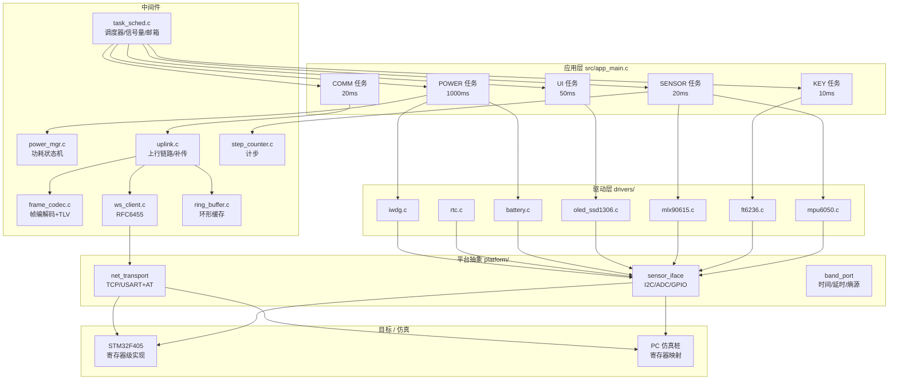

# STM32 低功耗智能健康监测手环（stm32-wearable-health-band）

一个**完整可编译、可运行、可测试**的智能手表/健康手环固件工程：
STM32F405RGT6 主控，MPU6050 六轴（含 FIFO/DMP 姿态解算与计步）、FT6236 电容触摸、
MLX90615 红外测温（SMBus + PEC 校验）、SSD1306 显示、锂电采样与电量计、RTC、独立看门狗；
自研轻量协作式调度器（task / semaphore / mailbox 语义，**不使用 uCOS/FreeRTOS 源码**）；
自定义帧协议 + 手写 RFC6455 WebSocket 客户端；断线重连、离线缓存、按序补传、远程参数下发。

> **本仓库最大特点：所有代码都能在 PC 上真实跑起来并自证。**
> 传感器走 `sensor_iface.h` 抽象 + 寄存器级仿真桩，因此驱动层的寄存器时序、
> 帧同步状态机、WebSocket 掩码编解码、补传去重逻辑全部被真实执行与断言，
> 而不是"写完没跑过"。所有实测数据见 [第 10 章](#10-实测数据)。

---

## 目录

1. [项目简介](#1-项目简介)
2. [系统框图](#2-系统框图)
3. [目录结构](#3-目录结构)
4. [硬件设计](#4-硬件设计)
5. [固件架构与调度器](#5-固件架构与调度器)
6. [驱动层详解](#6-驱动层详解)
7. [应用层帧协议](#7-应用层帧协议)
8. [WebSocket 协议实现](#8-websocket-协议实现)
9. [断线重连与数据补传](#9-断线重连与数据补传)
10. [实测数据](#10-实测数据)
11. [编译与测试方法](#11-编译与测试方法)
12. [代码规模与工程质量](#12-代码规模与工程质量)
13. [原创性与版权声明](#13-原创性与版权声明)
14. [可扩展点](#14-可扩展点)

---

## 1. 项目简介

### 1.1 这是什么

一块手表大小的健康监测终端，从**原理图设计**到**固件全栈**（驱动 → 调度 → 界面 →
通信 → 低功耗）的完整实现。板上有：

* **STM32F405RGT6**：Cortex-M4F @168MHz，1MB Flash / 192KB SRAM，硬件浮点
* **MPU6050**：三轴加速度 + 三轴陀螺，I2C，FIFO + DMP 姿态解算，计步
* **FT6236**：电容触摸控制器，I2C，支持触摸中断唤醒
* **MLX90615**：红外温度传感器，SMBus 接口，带 PEC 校验
* **SSD1306**：128×64 单色显示，I2C
* **锂电 + 充电管理 + 电量计 + LDO**：单节 180mAh，充电时可由 USB 供电
* **Wi-Fi 模组**：USART1 对接，跑 TCP → WebSocket 与手机 App 双向通信
* **板载天线**：PCB 倒 F 天线 + 净空区
* **振动马达、背光、按键**：人机交互

### 1.2 软件做到了什么

| 能力 | 实现位置 | 关键点 |
|------|----------|--------|
| 轻量协作式调度器 | `src/task_sched.c` | 优先级 + 时间片轮转 + 信号量 + 消息邮箱，无第三方内核 |
| 5 个业务任务 | `src/app_main.c` | 采集 / 按键 / 界面 / 通信 / 电源 |
| 7 个外设驱动 | `drivers/*.c` | 全部寄存器级操作，注释标注寄存器含义 |
| 自定义帧协议 | `src/frame_codec.c` | 帧头+长度+序号+载荷+CRC16 + 帧同步状态机（半包/粘包） |
| WebSocket 客户端 | `src/ws_client.c` | 手写握手、SHA-1、Base64、RFC6455 掩码编解码、ping/pong/close、分片重组 |
| 数据补传 | `src/ring_buffer.c` + `src/uplink.c` | 离线环形缓存 + 序号去重 + 按序补传 + ACK 确认 |
| 低功耗状态机 | `src/power_mgr.c` | 运行/空闲/休眠/唤醒 + 外设生命周期集中管理 + 事件日志 |
| 计步算法 | `src/step_counter.c` | 模值低通 + 重力基线 + 双阈值迟滞 + 不应期 + 自适应阈值 |
| 姿态融合 | `drivers/mpu6050.c` | 四元数微分 + 加速度重力修正（互补滤波） |

### 1.3 一句话数据

* **14,283 行** C/H 代码（不含 build 产物）
* **180 个测试用例 / 1,019 条断言 / 0 失败**
* **ASan + UBSan 全绿**（无越界、无未定义行为、无内存泄漏）
* **真实 TCP 端到端联调通过**：握手 → 收发 → 断线 → 缓存 8 条 → 重连 → 补传 8 条 →
  全部确认，服务端统计 **重复序号 0 / 乱序 0 / CRC 错误 0**

---

## 2. 系统框图

### 2.1 固件分层



### 2.2 数据流

```
┌─────────────── 采集侧 ───────────────┐   ┌──────────── 通信侧 ────────────┐
│ MPU6050 ─┐                           │   │                                │
│ FT6236 ──┼─► sensor_iface ─► 驱动 ─► SENSOR/KEY 任务                     │
│ MLX90615─┤        (I2C)              │        │                          │
│ BAT_ADC ─┘                           │        ├─► 体征快照 ──► data_mbox ─┼─► UI 任务 ──► SSD1306
└──────────────────────────────────────┘        │                          │
                                                └─► 帧编码 ──► uplink ──────┼─► WebSocket ──► Wi-Fi ──► App
                                                                           │        ▲
                                             离线缓存 ◄── 断网 ─────────────┘        │
                                             补传（按序号）─────────────────────────┘
```

---

## 3. 目录结构

```
stm32-wearable-health-band/
├── README.md                          本文件：项目介绍 + 硬件 + 驱动 + 协议 + 实测
├── docs/
│   └── DESIGN.md                      设计决策：任务划分依据、功耗状态机、补传去重取舍
├── firmware/
│   ├── Makefile                       构建/测试/联调/字库生成/目标语法校验
│   ├── platformio.ini                 PlatformIO 工程（env:band 目标板 / env:native PC 测试）
│   ├── include/                       对外接口（头文件即契约）
│   │   ├── band_config.h              全部编译期配置与协议常量（引脚、地址、帧格式、阈值）
│   │   ├── band_port.h                平台移植层：时间/延时/熵源/临界区
│   │   ├── band_platform.h            平台工厂：RTC/IWDG/USART 接口
│   │   ├── band_app.h                 应用层入口（不透明句柄 + 快照结构）
│   │   ├── sensor_iface.h             传感器总线抽象 + 仿真桩接口
│   │   ├── net_transport.h            TCP 传输抽象（socket / USART+AT）
│   │   ├── ring_buffer.h              字节环形缓冲 + 离线记录缓存 + 补传会话
│   │   ├── frame_codec.h              帧编解码 + 帧同步状态机 + TLV
│   │   ├── ws_client.h                WebSocket 客户端（含 SHA-1/Base64 原语）
│   │   ├── uplink.h                   数据上行链路：发送/补传/下行分发
│   │   ├── task_sched.h               调度器 + 信号量 + 消息邮箱
│   │   ├── power_mgr.h                功耗状态机 + 外设生命周期
│   │   ├── step_counter.h             计步算法
│   │   ├── mpu6050.h / ft6236.h / mlx90615.h / oled_ssd1306.h / oled_font.h
│   │   ├── battery.h / rtc.h / iwdg.h 各驱动接口
│   │   └── test_util.h                极简单元测试框架（无第三方依赖）
│   ├── src/                           中间件与业务
│   │   ├── task_sched.c               协作式调度器 + 信号量 + 邮箱
│   │   ├── ring_buffer.c              环形缓冲 + 离线缓存 + 补传去重
│   │   ├── frame_codec.c              帧编解码 + CRC16 + TLV + 载荷打包
│   │   ├── ws_client.c                手写 WebSocket（SHA-1/Base64/握手/掩码/保活）
│   │   ├── uplink.c                   上行链路：在线直发/离线缓存/补传/参数下发
│   │   ├── power_mgr.c                功耗状态机 + 事件日志
│   │   ├── step_counter.c             计步算法
│   │   └── app_main.c                 5 个任务、同步对象、界面渲染、外设登记
│   ├── drivers/                       寄存器级驱动
│   │   ├── mpu6050.c                  六轴 + FIFO/DMP 包解析 + 姿态融合
│   │   ├── ft6236.c                   电容触摸 + 手势识别
│   │   ├── mlx90615.c                 红外测温 + SMBus PEC
│   │   ├── oled_ssd1306.c            OLED 驱动 + 图形库（点/线/矩形/字）
│   │   ├── oled_font.c                5×7 点阵字库（由 tools/gen_oled_font.py 生成）
│   │   ├── battery.c                  电压采样 + VREFINT 校准 + 电量计
│   │   ├── rtc.c                      RTC 日历/闹钟/唤醒定时器
│   │   └── iwdg.c                     独立看门狗 + 任务级监督
│   ├── platform/                      平台实现（目标 / 仿真双份）
│   │   ├── port_stm32.c               时钟树/TIM2 毫秒基准/USART/STOP 低功耗
│   │   ├── bus_stm32.c                I2C1 主机事务/ADC1/GPIO（寄存器级）
│   │   ├── net_wifi_at.c              USART + Wi-Fi 模组 AT 指令 TCP
│   │   ├── rtc_iwdg_port.c            RTC/IWDG 的 MMIO 与仿真两套实现
│   │   ├── stm32f405_regs.h           STM32F405 寄存器定义（原创，不依赖 CMSIS）
│   │   ├── port_host.c                PC：时间/延时/熵源/虚拟 USART
│   │   ├── bus_sim.c                  PC：I2C 从机寄存器映射 + 故障注入
│   │   ├── net_socket.c               PC：POSIX socket 传输
│   │   └── main_host.c                PC 演示程序入口
│   └── test/                          单元测试 + 端到端联调客户端
│       ├── test_util.c/.h             测试框架
│       ├── test_frame_codec.c         帧编解码：正常/校验错/半包/粘包/TLV
│       ├── test_step_counter.c        计步：静止/步行/抖动/不应期
│       ├── test_ws_client.c           WebSocket：SHA1/Base64/握手/掩码/分片/重连
│       ├── test_power_mgr.c           低功耗：调用序列断言
│       ├── test_drivers.c             驱动 + 调度器 + 环形缓存
│       ├── test_uplink.c              上行链路 + 补传去重
│       ├── run_tests.c                测试总入口 + 整机冒烟
│       └── ws_live_client.c           真实 TCP 联调客户端（配合 mock server）
└── tools/
    ├── ws_mock_server.py              纯标准库 WebSocket 服务端（握手/掩码/ACK/断线）
    ├── run_ws_e2e.sh                  端到端联调脚本（起服务端→跑客户端→比对统计）
    └── gen_oled_font.py               5×7 点阵字库生成器（ASCII 艺术 → C 数组）
```

---

## 4. 硬件设计

### 4.1 接口分配表

| 功能 | MCU 引脚 | 外设 | 电气/时序要点 |
|------|----------|------|---------------|
| I2C1_SCL | PB6 | 全部 I2C 器件 | 复用开漏 + 4.7kΩ 上拉，100kHz 标准模式 |
| I2C1_SDA | PB7 | 全部 I2C 器件 | 同上 |
| MPU6050_INT | PC0 | MPU6050 INT | 推挽/低有效，接 EXTI0，用于 DMP 数据就绪与运动唤醒 |
| FT6236_INT | PC1 | FT6236 INT | 低有效，接 EXTI1，休眠期间作为触摸唤醒源 |
| KEY_WAKE | PC13 | 轻触按键 | 内部上拉 + 外部 100nF 消抖，接 EXTI13 |
| MOTOR_EN | PB0 | 振动马达 MOS | N-MOS 低边驱动 + 续流二极管，PWM 可调强度 |
| LCD_BL | PB1 | 背光 | TIM3_CH4 PWM，占空比映射 0~100% |
| WIFI_EN | PB2 | Wi-Fi 模组 EN | 高电平使能，休眠时拉低彻底断电 |
| USART1_TX/RX | PA9 / PA10 | Wi-Fi 模组 | 115200 8N1，DMA + 空闲中断收包 |
| BAT_ADC | PC4 | 电池分压 | ADC1_IN14，R1=R2=100kΩ 分压比 1/2 |
| VREFINT | ADC1_IN17 | 内部基准 | 1.21V，用于运行时校准 VDDA |
| SWDIO/SWCLK | PA13 / PA14 | 调试口 | **天线净空区内禁止走线，调试走线远离天线** |
| 天线馈点 | — | PCB 倒 F 天线 | 见 4.6 |

### 4.2 电源管理

```
        USB 5V
          │
     ┌────▼─────┐   ┌──────────────┐   ┌───────────────┐
     │ 充电管理IC│──►│ 锂电 180mAh  │──►│ LDO 3.3V      │──► 数字/模拟域
     │ (线性/开关)│   │ 单节 3.0~4.2V│   │ 低静态电流    │
     └────┬─────┘   └──────┬───────┘   └───────┬───────┘
          │ CHRG/STDBY 状态│                   │
          ▼                ▼                   ▼
      状态 GPIO      分压 100k/100k ──► PC4/ADC1_IN14
                     (电量计：库仑计 + OCV 查表)
```

**充电管理**：单节锂电线性充电 IC，具备 CC/CV 两阶段充电、过温降流、
充满自动截止；`CHRG` / `STDBY` 开漏状态脚接 MCU GPIO 用于界面显示充电动画。
充电电流按 0.5C（≈90mA）设定，兼顾充满时间与电池寿命。

**电量计（软件库仑计 + 开路电压融合）**：见 `drivers/battery.c`

1. **电压采样**：先读 `ADC1_IN17`(VREFINT) 的码值反推真实 VDDA：
   `VDDA_mV = 1210 × 4095 ÷ VREFINT_code`，
   再算电池电压 `VBAT_mV = adc_code × VDDA ÷ 4095 × 2`（分压比 2:1）。
   LDO 输出会随负载/温度漂移，按标称 3300mV 直接算会有 10% 以上误差，
   **用内部基准校准几乎是零成本地把误差压到 1% 以内**。
2. **过采样**：连续 16 次求平均，等效提高约 2 bit 有效位，抑制背光 PWM 噪声。
3. **OCV 查表 + 线性插值**：19 点锂电放电曲线（4200mV→100%，3300mV→0%）。
4. **库仑计积分**：`剩余mAh += I(mA) × Δt(ms) ÷ 3,600,000`。
5. **融合策略**：静置（|I| < 5mA）时用 OCV 校正库仑计消除累计误差；
   有充放电电流时更信任库仑计。

**LDO 供电**：低静态电流 LDO（Iq < 10µA），数字域 3.3V；
传感器域单独走一路可由 GPIO 控制的负载开关，休眠时彻底断电
（MLX90615 与触摸屏在休眠期不需要供电）。

### 4.3 低功耗与唤醒电路

| 唤醒源 | 硬件路径 | EXTI 线 | 典型场景 |
|--------|----------|---------|----------|
| RTC 闹钟/唤醒定时器 | RTC → EXTI17 | 17 | 定时刷新表盘、周期采集 |
| 触摸 | FT6236 INT → PC1 | 1 | 抬腕亮屏、点击唤醒 |
| 按键 | PC13 | 13 | 用户主动唤醒 |
| 运动 | MPU6050 INT → PC0 | 0 | 抬腕/走动唤醒（motion detect） |
| 串口数据 | USART1 RX | — | Wi-Fi 模组收到下行数据 |

进入 `STOP` 模式的写法（`platform/port_stm32.c`）：

```c
PWR->CR |= PWR_CR_LPDS;      /* 深度睡眠下调节器切低功耗 */
PWR->CR &= ~PWR_CR_PDDS;     /* 0 = STOP，而不是 STANDBY（要保留 SRAM 与寄存器） */
cpu_dsb();
cpu_wfi();                   /* 任意 EXTI 唤醒 */
PWR->CR |= PWR_CR_CWUF;      /* 清唤醒标志 */
PWR->CR &= ~PWR_CR_LPDS;     /* 恢复调节器 */
```

**关键设计**：STOP 模式下 HSE 与 PLL 关闭，唤醒后需要重新稳定；
所有外设时钟被门控，器件寄存器配置丢失，因此
**唤醒后必须按序重新初始化外设**（见 5.4 与 `docs/DESIGN.md` 第 2 节）。
这一点被测试用例逐条断言（桩函数记录调用序列）。

### 4.4 显示与电容触摸接口

**显示**：板载接口兼容两类面板，共用同一套图形 API（RAM 显存 → 分页刷屏）：

| 面板 | 接口 | 分辨率 | 本仓库驱动 |
|------|------|--------|-----------|
| SSD1306 OLED | I2C @ 0x3C | 128×64 单色 | ✅ `drivers/oled_ssd1306.c` 完整实现 |
| SPI TFT (ST7789 类) | SPI1 + DC/RST/BL | 240×240 彩色 | 走同一套显存/分页/字库 API，仅替换底层刷屏函数 |

选 SSD1306 作为默认方案的原因：I2C 只需 2 根线、无需背光（自发光）、
单色显存只有 1KB，对 SRAM 与功耗都友好；彩色 TFT 更适合后续做图形化表盘。

SSD1306 初始化序列（`drivers/oled_ssd1306.c`，来源：SSD1306 数据手册 Table 9-1）：

| 命令 | 值 | 含义 |
|------|----|------|
| `0xAE` | — | 关显示（先关再做配置） |
| `0xD5` | `0x80` | 显示时钟：振荡频率 8、分频 1 |
| `0xA8` | `0x3F` | 多路复用比 = 64 行 |
| `0xD3` | `0x00` | 显示偏移 0 |
| `0x40` | — | 显示起始行 0 |
| `0x8D` | `0x14` | **电荷泵使能（3.3V 供电必须开）** |
| `0x20` | `0x00` | 内存寻址模式：水平 |
| `0xA1` / `0xC8` | — | 段重映射 / COM 反向扫描（适配常见排线方向） |
| `0xDA` | `0x12` | COM 引脚配置：交替式，适配 128×64 |
| `0x81` | `0x7F` | 对比度 |
| `0xD9` | `0xF1` | 预充电周期 |
| `0xDB` | `0x40` | VCOMH 取消选择电平 |
| `0xA4` / `0xA6` | — | 显示跟随显存 / 正常显示 |
| `0x2E` | — | 关闭滚动 |
| `0xAF` | — | 开显示 |

**电容触摸（FT6236）**：I2C @ 0x38，寄存器映射（FocalTech 通用触摸 IC 手册）：

| 寄存器 | 地址 | 含义 |
|--------|------|------|
| `DEV_MODE` | 0x00 | 设备模式（bit6：0=正常 1=测试） |
| `GEST_ID` | 0x02 | 手势 ID |
| `TD_STATUS` | 0x03 | **有效触摸点数（bit3:0）** |
| `P1_XH` | 0x04 | 点 1：bit7:6=事件标志，bit3:0=X 高 4 位 |
| `P1_XL` | 0x05 | 点 1：X 低 8 位 |
| `P1_YH` / `P1_YL` | 0x06 / 0x07 | 点 1：Y（同 X 的高低位结构） |
| `P1_WEIGHT` / `P1_MISC` | 0x08 / 0x09 | 压力权重 / 触摸面积 |
| `P2_XH`.. | 0x0A.. | 点 2（结构相同） |
| `TH_GROUP` / `TH_DIFF` | 0x80 / 0x81 | 触摸阈值 |
| `CTRL` | 0x82 | bit0=1 使能"按时间自动进 monitor" |
| `TIMEENTERMONITOR` | 0x83 | 进入 monitor 的延时（秒） |
| `PERIODACTIVE` / `PERIODMONITOR` | 0x84 / 0x85 | 活动/monitor 扫描周期（ms） |
| `POWER_MODE` | 0x8A | 电源模式 |
| `FOCALTECH_ID` | 0x8C | 芯片 ID，**FT6236 读回 0x11** |
| `INT_MODE` | 0xA4 | 中断触发模式 |

坐标解析：

```c
x = ((P1_XH & 0x0F) << 8) | P1_XL;      /* 12bit 分辨率 */
y = ((P1_YH & 0x0F) << 8) | P1_YL;
event = (P1_XH >> 6) & 0x03;            /* 0=按下 1=抬起 2=持续接触 3=保留 */
```

驱动内置手势判定：单击（时长 ≤300ms 且位移 ≤12px）、长按（≥800ms）、
四向滑动（单轴位移 ≥40px 且大于另一轴）。

### 4.5 按键与振动马达

* **按键**：PC13，内部上拉 + 外部 100nF 硬件消抖，固件再做 10ms 周期采样 +
  边沿检测（`task_key`），支持短按翻页；同时作为 EXTI13 唤醒源。
* **振动马达**：PB0 经 N-MOS 低边驱动，固件提供 `motor_vibrate(now, ms)`
  定时关闭逻辑（在 `task_ui` 里检查到期时间），避免忘记关马达把电池耗光；
  马达开关可由手机 App 通过远程参数下发关闭（`TLV_TAG_MOTOR_ENABLE`）。

### 4.6 板载天线净空区

* 采用 **PCB 倒 F 天线（IFA）**，2.4GHz；天线区域（约 25×8mm）**所有层禁止铺铜、
  禁止走线、禁止放器件**，下方地平面完整开窗。
* 天线馈点与 Wi-Fi 模组之间走 50Ω 微带线，长度尽量短并做阻抗匹配网络
  （π 型：串联 0Ω + 并联 NC 焊盘，便于调试）。
* 电池与马达（强磁性/大电流器件）远离天线，马达连线双绞并靠近地。
* 天线净空区所在边沿严禁走 SWD 调试线——调试线在上电时会形成辐射源。
* 结构上手表外壳为塑料，金属表圈需在天线正上方开口。

---

## 5. 固件架构与调度器

### 5.1 为什么自己写调度器

手表软件的负载特征是"事件稀疏、时序一致性要求高、内存极紧、功耗敏感"。
抢占式内核（uCOS-II / FreeRTOS）要付出"每任务一份栈 + PendSV 汇编切换 +
tick 中断持续唤醒"的代价，对最大任务数不超过 6 且没有硬实时要求的手表是过度设计，
同时 uCOS-II 是商业授权代码（不能复制）。

因此本项目实现了**原创的协作式调度器**（`src/task_sched.c`）：
任务是被反复调用的函数，每次做一小步就 return；调度器在两次调用之间决策；
阻塞原语不做栈切换，拿不到资源就把任务标记 `TASK_BLOCKED` 并返回 `-1`。

详细论证见 [`docs/DESIGN.md`](docs/DESIGN.md) 第 1 节。

### 5.2 任务优先级表

| 任务名 | 优先级 | 周期 | 时间片 | 职责 |
|--------|-------:|-----:|-------:|------|
| `SENSOR` | 5（最高） | 20 ms | 5 ms | MPU6050 采集、计步、姿态融合、MLX90615 1Hz 测温、投递体征快照 |
| `KEY` | 4 | 10 ms | 3 ms | FT6236 触摸读取、手势判定、按键消抖、释放触摸信号量 |
| `UI` | 3 | 50 ms | 8 ms | 多级菜单、实时数据界面、显存绘制与整屏刷屏、马达定时关闭 |
| `COMM` | 2 | 20 ms | 10 ms | WebSocket 状态机、帧解码、周期上传、补传调度、远程参数生效 |
| `POWER` | 1（最低） | 1000 ms | 5 ms | 电池采样与库仑计、功耗状态机推进、任务级监督喂狗 |

优先级定序原则：**采集 > 输入 > 显示 > 通信 > 电源**。
采集放最高是因为 I2C 事务一旦开始就不能被打断（否则 FIFO 数据错位）；
电源放最低是因为它的工作全部可以延后，且它运行时会检查"是否还有任务在忙"。

### 5.3 同步对象

| 对象 | 类型 | 生产者 → 消费者 | 用途 |
|------|------|-----------------|------|
| `touch_sem` | 信号量（初值 0，上限 4） | `KEY` → `UI` | 事件驱动重绘，避免 UI 空转刷屏 |
| `data_mbox` | 邮箱（深度 8，16B/条） | `SENSOR` → `UI`/`COMM` | 体征快照传递 |
| `cmd_mbox` | 邮箱（深度 8，16B/条） | `KEY` → `UI` | 命令队列（切页/菜单移动/长按震动） |

调度器提供 `os_sem_post/pend/try_pend` 与 `os_mbox_post/pend/try_pend`，
并有溢出保护（信号量超过上限拒绝 post、邮箱满拒绝 post 并计数）。

### 5.4 低功耗状态机

```
RUN ──空闲 3s──► IDLE ──空闲 ≥15s 且无忙任务──► SLEEP ──唤醒源──► WAKEUP ──► RUN
```

进入休眠（先 `enter_low_power` 再 `deinit`）：
`MOTOR → MLX90615 → OLED → BAT_ADC → MPU6050 → FT6236 → WIFI`
唤醒（先 `exit_low_power` 再 `init`）：
`WIFI → FT6236 → MPU6050 → BAT_ADC → OLED → MLX90615 → MOTOR`
**RTC / IWDG 永不关闭**（`always_on=1`）。

`power_mgr_t` 把整条调用序列记进 128 条环形事件日志，测试直接断言序列内容。
详见 [`docs/DESIGN.md`](docs/DESIGN.md) 第 2 节。

### 5.5 看门狗：任务级监督喂狗

普通"每 500ms 喂一次"只能防死循环，防不了"某个任务被饿死"。
本项目让 5 个任务各自在周期内上报心跳（`iwdg_task_alive(name, now)`），
只有**所有受监督任务都在预算内**才真正写 `IWDG_KR = 0xAAAA`；
一旦有任务超期就**停止喂狗**，让 IWDG 复位整机，并把罪魁任务下标写进
RTC 备份寄存器 `BKP0R`，复位后由 `iwdg_check_reset()` 取回并打印：

```
[boot] IWDG reset detected, fault task = UI
```

超时参数自动求解：`T = (4 × 2^PR) × (RLR+1) ÷ f_LSI`，从最小预分频开始
向上取整找到 `RLR ≤ 4095` 的组合，保证**实际超时不小于请求值**。

---

## 6. 驱动层详解

所有驱动只依赖 `sensor_iface.h` 的总线抽象（`i2c_write/i2c_read/adc_read_raw/
gpio_read/millis/delay_ms`），因此同一份驱动代码在 STM32 上走真实 I2C 事务、
在 PC 上走寄存器映射仿真桩。**仿真桩不是空实现**：它按地址映射 256 字节寄存器块、
支持自动地址自增、自清位（DEVICE_RESET / FIFO_RESET）、NACK 注入、
数据位翻转注入以及 SMBus PEC 计算——所以驱动的正常与异常分支都被真实执行。

### 6.1 MPU6050 六轴

**接口**：I2C @ 0x68（7bit），WHO_AM_I 固定 0x68。

初始化时序（严格按 MPU-6000/6050 Register Map）：

| 步骤 | 寄存器 | 值 | 说明 |
|------|--------|----|------|
| 1 | `PWR_MGMT_1`(0x6B) | `0x80` | DEVICE_RESET 软复位（自清，需轮询等待） |
| 2 | `SIGNAL_PATH_RESET`(0x68) | `0x07` | 复位陀螺/加速度/温度信号通路 |
| 3 | `PWR_MGMT_1`(0x6B) | `0x01` | 退出 SLEEP，CLKSEL=001（PLL with X Gyro） |
| 4 | `PWR_MGMT_2`(0x6C) | `0x00` | 所有轴退出待机 |
| 5 | `CONFIG`(0x1A) | `0x03` | DLPF_CFG=3 → 加速度 44Hz / 陀螺 42Hz 带宽 |
| 6 | `SMPLRT_DIV`(0x19) | `0x09` | 采样率 = 1000/(1+9) = 100Hz |
| 7 | `GYRO_CONFIG`(0x1B) | `0x18` | FS_SEL=3 → ±1000dps（32.8 LSB/dps） |
| 8 | `ACCEL_CONFIG`(0x1C) | `0x08` | AFS_SEL=1 → ±4g（8192 LSB/g） |
| 9 | `INT_PIN_CFG`(0x37) | `0x20`/`0xA0` | 锁存中断 / 低有效（接 EXTI 唤醒） |
| 10 | `INT_ENABLE`(0x38) | `0x03` | DATA_RDY + DMP 中断使能 |

**数据读取**：从 `ACCEL_XOUT_H`(0x3B) 起一次突发读 14 字节，
覆盖加速度(6B) + 温度(2B) + 角速度(6B)，避免多次事务造成数据不同步。

**量程换算**：

| 传感器 | 原始值 | 物理量 |
|--------|--------|--------|
| 加速度 | `raw / accel_lsb_per_g` | 16384/8192/4096/2048 LSB/g（±2/4/8/16g） |
| 角速度 | `raw / gyro_lsb_per_dps` | 131/65.5/32.8/16.4 LSB/dps（±250/500/1000/2000dps） |
| 温度 | `raw / 340 + 36.53` | 摄氏度（数据手册公式） |

**FIFO / DMP 姿态通路**：`USER_CTRL`(0x6A) 的 `FIFO_EN`(bit6) 与 `FIFO_RESET`(bit2)
控制 FIFO；`FIFO_EN`(0x23) 决定哪些数据源进 FIFO；`FIFO_COUNTH/L`(0x72/0x73)
给出 13bit 字节计数（高 3 位是溢出标志）；`FIFO_R_W`(0x74) 是自增读窗口，
必须一次突发读完。

> ⚠️ **关于 DMP 微码的版权说明**：InvenSense 的 DMP 微码镜像（`dmpImage.h` 之类）
> 是厂商版权固件，**本仓库不包含、不复制、不搬运**。
> 本项目实现的是"与 DMP 等价的输出通路"：片上 FIFO 按固定 28 字节包格式搬运
> 四元数(Q30) + 加速度 + 角速度，姿态由**自研的四元数微分 + 加速度重力修正
> （互补滤波）**计算，对外接口语义与 eMPL 的 `dmp_read_fifo()` 一致。
>
> DMP 兼容包格式（28 字节，大端）：

| 偏移 | 长度 | 内容 |
|-----:|-----:|------|
| 0..15 | 16 | 四元数 w, x, y, z，各 int32，Q30 定点（`值/2^30` 得浮点） |
| 16..21 | 6 | 加速度 ax, ay, az，int16 |
| 22..27 | 6 | 角速度 gx, gy, gz，int16 |

**姿态融合算法**（`mpu6050_fuse_attitude`）：

1. 陀螺（dps→rad/s）代入四元数微分方程积分：`q̇ = ½·q⊗ω`
2. 用加速度计测得的重力方向计算误差：`e = a_meas × v_est`
3. 以 `Kp = 0.6` 的比例把误差反馈回陀螺积分项（互补滤波的低频通道）
4. 归一化四元数，转欧拉角（roll/pitch/yaw）

**运动唤醒**：`MOT_THR`(0x1F) 阈值（1 LSB = 2mg @±2g，随量程翻倍）、
`MOT_DUR`(0x20) 持续时间（1 LSB = 1ms），配合锁存 + 低有效中断输出，
休眠期间可由"抬腕"唤醒 MCU。

### 6.2 FT6236 电容触摸

见 [4.4](#44-显示与电容触摸接口) 的寄存器表。驱动要点：

* 上电先读 `FOCALTECH_ID`(0x8C)，**必须是 0x11**，否则拒绝初始化
  （防止焊错成 GT911 等型号却不报错）；
* 一次事务从 `GEST_ID`(0x02) 连续读 14 字节，覆盖手势 + 点数 + 2 个点；
* 有效点数取 `TD_STATUS & 0x0F`，超过驱动支持数时裁剪而不是报错；
* 坐标是 12bit（高 4 位在 XH/YH 的低半字节）；
* 手势状态机在 `ft6236_gesture_update()` 里，按下沿记起点、抬起沿判定
  单击/滑动、持续接触超时判长按；
* 休眠时写入 `POWER_MODE`(0x8A) + `CTRL`(0x82) 进入 monitor 模式
  （30ms 扫一次），触摸时拉低 INT 唤醒 MCU。

### 6.3 MLX90615 红外测温（SMBus + PEC）

**接口**：SMBus @ 0x5A（7bit），16bit 数据，**带 PEC 校验**。

| 地址 | 类型 | 含义 |
|------|------|------|
| 0x06 | RAM | `TA` 环境温度 |
| 0x07 | RAM | `TOBJ1` 目标（人体）温度 |
| 0x10..0x1F | EEPROM | SMBus 地址（SA） |
| 0x20..0x2F | EEPROM | 发射率（Emissivity） |

**温度换算**：`T[K] = raw × 0.02`，摄氏度 = `raw × 0.02 − 273.15`。

**SMBus Read Word + PEC 事务**：

```
S | 0x5A<<1|W | Cmd | Sr | 0x5A<<1|R | DataLow | DataHigh | PEC(从机给) | P
```

**PEC = CRC-8**，多项式 `x⁸ + x² + x + 1 = 0x07`，初值 0x00，不反射、不异或输出。
计算范围（SMBus 2.0 §6.4）：

| 事务 | PEC 覆盖的字节序列 |
|------|--------------------|
| Read Word | `Addr+W, Command, Addr+R, DataLow, DataHigh` |
| Write Word | `Addr+W, Command, DataLow, DataHigh` |

注意：PEC 覆盖的"地址字节"**包含 R/W 位**，且读事务里包含重复起始后的地址字节。
PEC 不匹配时**必须拒绝该次数据**（`SENSOR_ERR_CRC`）而不是凑合用——
本项目在仿真桩里支持"下一次读的 PEC 位翻转"来验证这条拒绝分支。

**体温估计**：红外测的是目标表面辐射温度，手腕表面比核心体温低，
且受环境温度影响，因此做经验补偿：

```
T_body ≈ T_obj + 0.12 × (T_obj − T_amb) + 1.6℃
```

梯度大说明散热快（环境冷），需要更多补偿；
发射率偏离 1.0 时读数偏低，按 `(1−E) × 3.0` 粗补偿。
两个系数都可以在产线上用耳温枪标定后写入参数区。

### 6.4 SSD1306 显示

见 [4.4](#44-显示与电容触摸接口) 的初始化序列表。驱动实现要点：

* 控制字节：`0x00`+命令流 / `0x40`+数据流 / `0x80`+单命令 / `0xC0`+单数据；
* 驱动内部维护 **1KB 显存镜像**，所有绘图先落在 RAM；
* `flush()` 按页搬运（8 页 × 128 字节），每页先设页地址再写数据，
  共 16 次 I2C 事务；避免"每画一个像素发一次 I2C"；
* 图形 API：画点（带越界裁剪）、水平/垂直线、Bresenham 直线、矩形、
  字符、字符串、2 倍放大字符串、无符号整数；
* **5×7 ASCII 字库**（0x20..0x7E 共 95 个字形）由
  `tools/gen_oled_font.py` 从 ASCII 艺术生成，是自建字库（不复制第三方点阵库），
  不可打印字符统一回退为 `?`。

显存组织：8 页 × 128 列，每字节表示该页内一列的 8 个像素，bit0 在上。

### 6.5 电池采样与电量计

见 [4.2](#42-电源管理)。核心公式：

```c
VDDA_mV = 1210 × 4095 / VREFINT_code;              /* 用内部基准校准 LDO */
VBAT_mV = adc_code × VDDA_mV / 4095 × 2;           /* 分压比 2:1 */
percent = OCV_LUT(VBAT_mV);                        /* 19 点曲线线性插值 */
mah    += I_mA × Δt_ms / 3600000;                  /* 库仑计积分 */
```

静置时用 OCV 校正库仑计，有电流时信库仑计，两者融合出最终百分比。
低于 10% 置 `low_battery`，低于 3% 置 `critical`（用于强制进低功耗）。

### 6.6 RTC

**寄存器**（基址 `0x40002800`，全部寄存器级访问）：

| 偏移 | 寄存器 | 关键位 |
|------|--------|--------|
| 0x00 | `RTC_TR` | 时间 BCD：HT[21:20] HU[19:16] MNT[14:12] MNU[11:8] ST[6:4] SU[3:0] |
| 0x04 | `RTC_DR` | 日期 BCD：YT[23:20] YU[19:16] WDU[15:13] MT[12:8] MU[7:4] DT[5:4] DU[3:0] |
| 0x08 | `RTC_CR` | WUTE(10) WUTIE(14) ALRAE(8) ALRAIE(12) BYPSHAD(6) FMT(5) |
| 0x0C | `RTC_ISR` | INIT(7) INITF(6) RSF(5) WUTF(10) ALRAF(8) WUTWF(2) ALRAWF(0) |
| 0x10 | `RTC_PRER` | PREDIV_S[14:0] PREDIV_A[22:16] |
| 0x14 | `RTC_WUTR` | 唤醒自动重载（16bit，时钟 = ck_spre = 1Hz） |
| 0x1C | `RTC_ALRMAR` | 闹钟 A：MSK4(31)..MSK1(7) 可屏蔽字段 |
| 0x24 | `RTC_WPR` | 写保护：先写 0xCA 再写 0x53 解锁 |

初始化时序（RM0090 §26.3.5）：使能 LSE → 解锁写保护（0xCA/0x53）→
进入初始化模式（`ISR.INIT=1` 并等 `INITF=1`）→ 写 `PRER`（异步 127 + 同步 255
→ 32768/128/256 = 1Hz）与 `TR`/`DR` → 退出初始化并等 `RSF=1` → 重新上锁。

驱动还提供纯函数的日期换算（可脱离硬件单测）：
BCD 编解码、闰年判断、月天数、Sakamoto 星期算法、2000 基准的 Unix 秒换算。
读时间时**连读两次直到一致**，避免在秒进位瞬间读到撕裂值。

### 6.7 独立看门狗 IWDG

**寄存器**（基址 `0x40003000`）：`KR`(0x00) 键寄存器、`PR`(0x04) 预分频、
`RLR`(0x08) 重装载、`SR`(0x0C) 状态（PVU/RVU/WVU）。

* `KR = 0x5555` 解除 PR/RLR 写保护，`0xAAAA` 喂狗，`0xCCCC` 启动；
* 写 PR/RLR 后**必须等 `SR` 的 PVU/RVU 清零**，否则下一次喂狗用的是旧值；
* 超时 `T = (4 × 2^PR) × (RLR+1) ÷ f_LSI`，`f_LSI ≈ 32kHz`
  （RM0090 给出的范围 17~47kHz，因此配置值要按最坏情况校验）。

**任务级监督喂狗**是本驱动与普通实现的最大区别，见 [5.5](#55-看门狗任务级监督喂狗)。

### 6.8 计步算法

```
|a| = √(ax²+ay²+az²)                             加速度模值 (mg)
lp   += (|a| − lp) >> 3                          一阶低通，去高频抖动
base += (lp − base) >> 5                         重力基线滑动平均（≈1000mg）
dyn   = lp − base                                动态分量，走动时是准正弦
thr   = max(55mg, 0.55 × median(最近 8 个波峰))   自适应阈值
```

判定逻辑：`dyn ≥ thr` 记上升沿 → 跟踪波峰 → 回落到 `thr − 25mg` 以下确认一步。
**不应期 250ms**：距上一步太近的上升沿直接判为抖动。

> 为什么不应期判断放在"上升沿"而不是"波峰确认"上？
> 真实步态信号从峰值回落到阈值以下还要几百毫秒，如果在确认时才判断，
> 相邻两步的确认时刻会被滤波延迟"拉近"，反而挡不住抖动。
> 这是把判断点前移才能真正抑制重复计数。

**自适应阈值**取最近 8 个有效波峰幅值的**中位数**（比均值抗单次异常冲击）的 55%，
与下限 55mg 取大者——这样快走/慢走都能稳定检出，而低于阈值的日常小动作不计步。

输出除了步数，还有实时步频（spm）与置信度（0..100），供上层判断数据质量。

---

## 7. 应用层帧协议

### 7.1 帧格式

```
 偏移  0      1      2       3-4        5-6       7..7+LEN-1   7+LEN .. 8+LEN
     ┌──────┬──────┬───────┬──────────┬─────────┬────────────┬───────────┐
     │ SOF0 │ SOF1 │ TYPE  │   SEQ    │   LEN   │  PAYLOAD   │   CRC16   │
     │ 0xAA │ 0x55 │ 1B    │  2B LE   │ 2B LE   │  LEN 字节   │  2B LE    │
     └──────┴──────┴───────┴──────────┴─────────┴────────────┴───────────┘
      ←───────── 帧头 7 字节 ─────────→                        ← CRC 2B →
      整帧长度 = 9 + LEN
```

* **CRC16/CCITT-FALSE**：poly = 0x1021，init = 0xFFFF，不反射、不异或输出；
  覆盖范围 `TYPE..PAYLOAD` 末字节（即从偏移 2 开始，共 `5 + LEN` 字节）。
  标准校验向量：`"123456789"` → `0x29B1`。
* 字节序统一**小端**。
* 最大载荷 `FRAME_MAX_PAYLOAD = 256`，最大帧长 265 字节。

### 7.2 帧类型

| 类型 | 值 | 方向 | 载荷 |
|------|----|------|------|
| `MSG_HEART_RATE` | 0x01 | 上行 | 心率相关 |
| `MSG_STEP_COUNT` | 0x02 | 上行 | 步数 |
| `MSG_TEMPERATURE` | 0x03 | 上行 | 体温 |
| `MSG_BATTERY` | 0x04 | 上行 | 电量 |
| `MSG_ATTITUDE` | 0x05 | 上行 | 姿态角 |
| `MSG_HEALTH_BATCH` | 0x06 | 上行 | **17 字节聚合体征包** |
| `MSG_ACK` | 0x10 | 双向 | `status(1) + ack_seq(2)` |
| `MSG_NACK` | 0x11 | 双向 | 否定确认 |
| `MSG_PARAM_SET` | 0x20 | 下行 | TLV 远程参数 |
| `MSG_PARAM_QUERY` | 0x21 | 下行 | 参数查询 |
| `MSG_PARAM_REPORT` | 0x22 | 上行 | 参数上报 |
| `MSG_TIME_SYNC` | 0x23 | 下行 | uint32 Unix 秒 |
| `MSG_OFFLINE_BATCH` | 0x30 | 上行 | 补传数据 |
| `MSG_PING` / `MSG_PONG` | 0x40 / 0x41 | 双向 | 心跳 |
| `MSG_LOG` | 0x80 | 上行 | 调试日志 |

**聚合体征包（17 字节）**：

| 偏移 | 类型 | 字段 |
|-----:|------|------|
| 0 | u8 | `heart_rate` (bpm) |
| 1 | u8 | `confidence` (0..100) |
| 2 | u16 | `rr_interval_ms` |
| 4 | i16 | `temperature_c100` (0.01℃) |
| 6 | u16 | `steps` |
| 8 | u16 | `battery_mv` |
| 10 | u8 | `battery_pct` |
| 11 | i16 | `roll_c100` (0.01°) |
| 13 | i16 | `pitch_c100` |
| 15 | i16 | `yaw_c100` |

### 7.3 远程参数 TLV

格式：`TAG(1B) + LEN(1B) + VALUE(LEN)`，连续排列，无填充。

| TAG | 名称 | 类型 | 取值范围 |
|-----|------|------|----------|
| 0x01 | `HR_INTERVAL` | u16 | 100..10000 ms |
| 0x02 | `STEP_SENSITIVITY` | u8 | 0..100 |
| 0x03 | `UPLOAD_INTERVAL` | u16 | 500..60000 ms |
| 0x04 | `SLEEP_TIMEOUT` | u16 | 5..3600 s |
| 0x05 | `LCD_BRIGHTNESS` | u8 | 0..100 |
| 0x06 | `MOTOR_ENABLE` | u8 | 0/1 |
| 0x07 / 0x08 | `WIFI_SSID` / `WIFI_PASS` | string | ≤32B |
| 0x09 | `DEVICE_NAME` | string | ≤32B |

解析策略：**格式非法整包拒绝**（不做部分应用，避免参数处于半更新状态）；
**值越界则忽略该项并计数**（保持连接可用性）。

### 7.4 帧同步状态机

`frame_decoder_t` 是 10 状态机（SOF0 → SOF1 → TYPE → SEQ(2) → LEN(2) →
PAYLOAD → CRC(2)），逐字节推进：

| 场景 | 行为 |
|------|------|
| 半包 | 返回 `FRAME_DEC_NONE` 并保留全部中间状态，下次继续喂 |
| 粘包 | 一次调用只产出一帧，调用方循环喂剩余字节即可 |
| 校验错 | 返回 `FRAME_DEC_CRC_ERR`，丢弃当前帧但**不丢弃缓冲区**（后续字节可能已是新帧头） |
| 长度超限 | 立即返回 `FRAME_DEC_LEN_ERR` 并回到 SOF 搜索态，避免被畸形长度卡死 |
| 帧头前垃圾 | 自动重新对齐并累加 `resyncs` 计数 |
| `0xAA 0xAA 0x55` | 不误判为帧头（识别到重复 SOF0 时停在 SOF1 继续等） |

---

## 8. WebSocket 协议实现

`src/ws_client.c`（约 1000 行）**完全手写**，不依赖任何第三方库（连 SHA-1 和
Base64 都是自己实现的），因为目标板无法引入 OpenSSL 之类依赖。

### 8.1 HTTP Upgrade 握手

**客户端请求**（`ws_build_handshake`）：

```
GET /band HTTP/1.1
Host: 127.0.0.1:9001
Upgrade: websocket
Connection: Upgrade
Sec-WebSocket-Key: <base64(16 字节随机数)>
Sec-WebSocket-Version: 13
User-Agent: stm32-wearable-health-band/1.0.3
<空行>
```

| 字段 | 值 / 规则 |
|------|-----------|
| 请求行 | `GET <path> HTTP/1.1` |
| `Host` | `<host>:<port>` |
| `Upgrade` | 必须为 `websocket`（大小写不敏感） |
| `Connection` | 必须包含 `Upgrade` |
| `Sec-WebSocket-Key` | **16 字节随机数的 base64**（24 字符），每次握手必须不同，否则服务端会认为是重放 |
| `Sec-WebSocket-Version` | 固定 `13` |

**服务端响应**（客户端校验）：

```
HTTP/1.1 101 Switching Protocols
Upgrade: websocket
Connection: Upgrade
Sec-WebSocket-Accept: <base64(SHA1(key + GUID))>
```

* GUID 固定为 `258EAFA5-E914-47DA-95CA-C5AB0DC85B11`；
* 客户端**必须**校验 `Sec-WebSocket-Accept` 是否等于
  `base64(SHA1(key + GUID))`，否则拒绝连接（防缓存污染/中间人）；
* 校验通过后，若 101 响应里已经跟了 WebSocket 数据帧，必须把尾部字节
  留在接收缓冲里而不是丢掉（本项目实现里处理了这个边界）。

标准测试向量（RFC6455 §1.3）：

```
Key     = "dGhlIHNhbXBsZSBub25jZQ=="          (即 "the sample nonce")
Accept  = "s3pPLMBiTxaQ9kYGzzhZRbK+xOo="
```

这两个值被 `test_ws_client.c` 直接断言，用来验证自研 SHA-1 与 Base64 的正确性
（另加 SHA-1 标准向量 `SHA1("abc") = a9993e36...` 与 CRC/Base64 填充边界）。

### 8.2 RFC6455 帧格式

```
 0                   1                   2                   3
 0 1 2 3 4 5 6 7 8 9 0 1 2 3 4 5 6 7 8 9 0 1 2 3 4 5 6 7 8 9 0 1
+-+-+-+-+-------+-+-------------+-------------------------------+
|F|R|R|R| opcode|M| Payload len |    Extended payload length    |
|I|S|S|S|  (4)  |A|     (7)     |           (16/64)             |
|N|V|V|V|       |S|             |   (payload len==126/127 时)    |
| |1|2|3|       |K|             |                               |
+-+-+-+-+-------+-+-------------+ - - - - - - - - - - - - - - - +
|     Extended payload length continued, if payload len == 127  |
+ - - - - - - - - - - - - - - - +-------------------------------+
|                               | Masking-key, if MASK set to 1 |
+-------------------------------+-------------------------------+
| Masking-key (continued)       |          Payload Data         |
+-------------------------------- - - - - - - - - - - - - - - - +
```

| 字段 | 位宽 | 规则（本实现） |
|------|------|----------------|
| FIN | 1 | 1 = 末片，0 = 还有后续分片 |
| RSV1/2/3 | 3 | **必须为 0**（未协商任何扩展），否则判协议错 |
| opcode | 4 | 0x0 继续 / 0x1 文本 / 0x2 二进制 / 0x8 关闭 / 0x9 ping / 0xA pong |
| MASK | 1 | **客户端发出的帧必须为 1**；服务端发来的帧必须为 0 |
| Payload len | 7 | ≤125 直接表示；126 → 后续 2 字节（大端）；127 → 后续 8 字节 |
| Masking-key | 32 | MASK=1 时存在，**每个帧都要用新的随机掩码键** |
| Payload | 变长 | `payload[i] ^= mask_key[i % 4]` |

**掩码规则（客户端强制）**：

* 客户端 → 服务端：**必须掩码**。本实现用 `band_entropy()` 生成的 xorshift
  随机数取 4 字节做掩码键，**每帧重新生成**（RFC6455 §5.3 要求）；
* 服务端 → 客户端：**必须不掩码**。若收到带掩码的帧，客户端按协议错误处理
  （关闭连接、`protocol_errors++`）——该分支有专门的测试用例。

**控制帧约束**：FIN 必须为 1、载荷 ≤ 125 字节，且**不允许使用扩展长度**。
这三条约束必须在"数据是否收齐"判断之前检查，否则一个声明了超长载荷的
控制帧会被误判成"半包"而无限等待（这是实现时踩过的坑，已修正）。

**分片重组**：`opcode=0x0`（continuation）帧累积到 `frag[]`，
FIN 到来时用首个分片的 opcode 一次性派发给上层。

### 8.3 保活与关闭

| 机制 | 实现 |
|------|------|
| ping | 空闲超过 15s（`WS_PING_INTERVAL_MS`）主动发 ping |
| pong | 收到 ping **必须**回 pong，且载荷与 ping 完全一致（本项目按 RFC 要求回显） |
| 超时判定 | 发出 ping 后 5s 内未收到 pong，判定链路已死 → 关闭 socket → 进入 ERROR 态等待重连 |
| close 握手 | 收到 close 帧 → 回一个 close 帧 → 关闭 TCP → 状态置 CLOSED |
| 协议错 | RSV≠0 / 控制帧超长 / 控制帧 FIN=0 / 收到掩码帧 → 关闭连接并重连 |

### 8.4 断线重连（指数退避）

```
失败 1 次 → 200ms
失败 2 次 → 400ms
失败 3 次 → 800ms
...
失败 6 次 → 8000ms（上限）
成功一次 → 退避复位到 200ms，retry_count 清零
```

上限 8s 是为了"网络恢复后能较快重连"与"断网时把路由器打爆"之间的平衡。
实测 6 次连续失败后 `backoff = 8000ms`（见第 10 章表格）。

### 8.5 传输抽象

WebSocket 客户端只依赖 `net_transport_t`（connect/send/recv/close/is_open）：

* **PC 仿真**：`platform/net_socket.c` —— POSIX socket + 非阻塞 connect + select 超时
  （Windows 下也可编译，走 Winsock）；
* **目标板**：`platform/net_wifi_at.c` —— USART + Wi-Fi 模组 AT 指令
  （`AT` / `AT+CIPMUX=0` / `AT+CIPSTART="TCP","host",port` / `AT+CIPSEND=<len>`）。

所以**同一份 RFC6455 实现既能跑在 PC 上被测，也能跑在板子上**。

---

## 9. 断线重连与数据补传

### 9.1 完整时序

```
 手机/服务器                    STM32 手环                          离线缓存
     │                              │                                   │
     │◄──── HTTP Upgrade 握手 ───────│  ① 建链                           │
     │───── 101 + Accept ──────────►│                                   │
     │                              │                                   │
     │◄──── 体征帧 seq=n ────────────│  ② 在线直发                        │
     │───── ACK(seq=n) ────────────►│     从缓存移除（若曾在补传中）        │
     │                              │                                   │
     │         ✗ 网络中断 ✗          │  ③ 断线检测（recv 返回 CLOSED）    │
     │                              │──── 整帧入缓存（序号=帧头 SEQ）────►│
     │                              │                                   │
     │                              │  ④ 指数退避重连 200→400→…→8000ms   │
     │◄──── 重新握手 ────────────────│                                   │
     │───── 101 + Accept ──────────►│                                   │
     │                              │  ⑤ resend_begin()：清空"本轮已发"标记│
     │◄──── 补传 seq=a ──────────────│◄──── resend_next() 按序号升序取 ────│
     │───── ACK(seq=a) ────────────►│     移除该记录，推进确认水位线        │
     │◄──── 补传 seq=a+1 ... ────────│     （每轮最多 8 条，防占满链路）     │
     │                              │                                   │
     │                              │  ⑥ 缓存为空 → 恢复"在线直发"模式     │
```

### 9.2 为什么不会重复

三层保证：

1. **同一会话内每条只发一次**：`offline_rec_t.sent` 标记随记录一起搬移，
   删除记录不会导致标记错位（早期用并行数组的版本会错位并重复发送，
   已被测试抓出并修正）。
2. **跨会话重传由"序号幂等"兜底**：ACK 可能在网络里丢失，所以跨会话重传是
   必须的；服务端按序号去重，只落库一次。本项目 `tools/ws_mock_server.py`
   实现了同样的逻辑并断言 `duplicates == 0`。
3. **缓存记录号 = 帧头 SEQ**：这是保证 ACK 能精确匹配到记录的前提。
   两者不一致时会出现"删错记录、正确记录永远确不掉、被反复重发"的严重缺陷——
   这个缺陷**只有真实 TCP 联调才能暴露**，纯单元测试测不出来。

### 9.3 为什么不会丢

| 风险 | 对策 |
|------|------|
| 断网瞬间 | 直发失败**降级入缓存**，而不是返回错误丢弃 |
| 缓存满 | 环形缓存覆盖**最旧**记录并累加 `dropped_total`（新数据比旧数据有价值） |
| 补传失败 | `uplink_resend_burst()` 把该记录的 `sent` 标记复位并重扫，下轮重试而不是跳过 |
| 序号回绕 | 序号 0 保留为"未分配"，回绕跳过 0，比较统一用 `(int16_t)(a−b)` |

### 9.4 可观测性

`uplink_stats_t` 提供 13 个计数器；UI 的"网络"页显示关键几项；
联调客户端用 `-v` 参数可打印每一帧的收发/确认明细：

```
[uplink] TX raw 15 字节
[uplink] RX type=0x10(ACK) seq=3 len=3
[uplink]   ACK seq=3 已确认，pending=7
```

---

## 10. 实测数据

> 全部数据来自本仓库真实运行输出，命令见 [第 11 章](#11-编译与测试方法)。
> 环境：WSL2 Ubuntu 22.04 / gcc 11.4.0 / GNU Make 4.3 / Python 3.10.12。

### 10.1 单元测试总览

| 套件 | 用例数 | 断言数 | 失败 |
|------|-------:|-------:|-----:|
| `frame_codec`（帧编解码） | 17 | 105 | 0 |
| `step_counter`（计步） | 29 | 129 | 0 |
| `ws_client`（WebSocket） | 63 | 272 | 0 |
| `power_mgr`（低功耗） | 76 | 375 | 0 |
| `drivers_and_sched`（驱动+调度） | 159 | 862 | 0 |
| `uplink_and_resend`（补传去重） | 176 | 994 | 0 |
| `app_smoke`（整机冒烟） | 180 | 1019 | 0 |
| **合计** | **180** | **1019** | **0** |

（用例/断言是累计值，各套件行展示该套件结束时的累计数。）

### 10.2 帧编解码

| 场景 | 输入 | 期望 | 实测 |
|------|------|------|------|
| CRC16 标准向量 | `"123456789"` | `0x29B1` | ✅ `0x29B1` |
| 正常帧往返 | TYPE=0x01 SEQ=0x1234 LEN=8 | 17 字节，字段全对 | ✅ 通过 |
| 半包（分 3 段：3B / 9B / 7B） | 中间不得产出帧 | 前两段无帧，第三段出帧 | ✅ 通过 |
| 粘包（3 帧一次喂入） | 26+27+28 字节 | 解出 3 帧且序号 1/2/3 | ✅ 通过 |
| 粘包 + 尾部半包（2.5 帧） | 解出 2 帧并保留状态 | 补齐后第 3 帧解出 | ✅ 通过 |
| 载荷位翻转 | 翻转 1 bit | `FRAME_DEC_CRC_ERR`，`crc_errors=1` | ✅ 通过 |
| CRC 字段翻转 | 翻转 1 bit | 拒绝，成功帧计数仍为 0 | ✅ 通过 |
| 长度非法（LEN=0x0FFF） | > 256 | `FRAME_DEC_LEN_ERR` + 重新同步 | ✅ 通过 |
| 帧头前垃圾字节 | `00 FF AA 00 55` | 自动 resync 并解出后续帧 | ✅ 通过 |
| TLV 参数（4 项整数+字符串） | 25 字节 | 4 项全部解析正确 | ✅ 通过 |
| TLV 长度越界 / 值超长 / 残留半头 | 畸形输入 | 分别返回 `-2 / 负值 / -4` | ✅ 通过 |

### 10.3 WebSocket

| 场景 | 期望 | 实测 |
|------|------|------|
| SHA-1 标准向量 | `SHA1("abc")` | ✅ `a9993e36...` |
| Base64 三种填充 | `YQ== / YWI= / YWJj` | ✅ 全部正确 |
| RFC6455 §1.3 握手向量 | Key→Accept | ✅ `s3pPLMBiTxaQ9kYGzzhZRbK+xOo=` |
| 请求字段完整性 | 7 个必需字段 | ✅ 全部存在且格式正确 |
| 101 响应解析（头名大小写不敏感） | 成功 | ✅ 通过 |
| 400/403 状态码 | 拒绝 | ✅ 返回 `-2` |
| Accept 不匹配 | 拒绝 | ✅ 返回 `-7` |
| 缺 Accept / 缺 Upgrade | 拒绝 | ✅ 返回 `-6 / -3` |
| 客户端帧掩码位 | MASK=1 | ✅ 抓包验证，且解掩码后与原文一致 |
| 服务端帧带掩码 | 协议错 | ✅ 断开并 `protocol_errors++` |
| RSV≠0 / 控制帧 FIN=0 / 控制帧 len>125 | 全部拒绝 | ✅ 分别返回 `-1` |
| 扩展长度 126（300 字节） | 正确编解码 | ✅ 通过 |
| ping 自动回 pong（载荷回显） | 长度 2+4+2 | ✅ 载荷 `xy` 完全回显 |
| 主动 ping → 收 pong | `ping_pending` 清零 | ✅ 通过 |
| 分片重组（TEXT + CONT） | 只在末片回调一次 | ✅ `HELLO!` |
| 半包（3B 后补齐 7B） | 不提前回调 | ✅ 通过 |
| 粘包（一条 recv 两帧） | 回调两次 | ✅ 通过 |
| close 握手 | 回 close 帧 + TCP 关闭 | ✅ 通过 |
| 指数退避（连续 6 次失败） | backoff 单调不减，≤8s | ✅ `8000ms`，`reconnect_count=6` |
| 恢复后重连 | 回 OPEN，退避复位 | ✅ `retry_count=0, backoff=200ms` |

### 10.4 真实 TCP 端到端联调

命令：`make -C firmware live-test`（起 `tools/ws_mock_server.py` + C 客户端）。

**客户端实测输出（节选）**：

```
[client] 1) 发起 TCP 连接与 HTTP Upgrade 握手 ...
[client]    握手成功: state=ONLINE
[client]    Sec-WebSocket-Key   = 0IwEvaL0DiYE6aMxn5GE6A==
[client]    Sec-WebSocket-Accept= pxNBA0okA/ezkSuGKHVVi1vsKFE=
[client] 2) 发送一条体征数据（MSG_HEART_RATE）...
[client]    已发送 seq=1 rc=0, tx_frames=1
[client] 3) 等待对端下行数据 ...
[client]   参数更新 v1: hr_interval=800ms sensitivity=72 upload=3000ms sleep=45s name=MOCK-APP
[client]    收到下行: rx_frames=2 acks=1 params_applied=1
[client] 4) 等待服务端主动断开 ...
[client]    已检测到断线: ws_state=ERROR link=ERROR（已暂停自动重连）
[client] 5) 断网期间缓存 8 条记录 ...
[client]    缓存第 1 条: seq=3 返回=1（1=已入离线缓存）
             ...（共 8 条，seq=3..10）
[client]    离线缓存条数 = 8
[client] 6) 恢复网络 -> 重连并按序号补传 ...
[client]    重连成功: state=ONLINE, 补传会话轮次=2
[client] ---------- 实测结果汇总 ----------
[client] 连接次数(重连计数) = 2
[client] 在线直发帧数       = 2
[client] 离线缓存帧数       = 8
[client] 补传帧数           = 8
[client] 收到 ACK 数        = 9
[client] 重复/未跟踪 ACK 数 = 1（在线直发帧的确认没有进补传跟踪表）
[client] 收到下行帧数       = 10
[client] 远程参数应用次数   = 1
[client] 剩余待补传条数     = 0
[client] 补传去重拦截次数   = 8
[client] WebSocket 统计: tx_frames=10 rx_frames=10 ping=0 pong=0 handshake_ok=2 proto_err=0
[client] 自检结论: PASS
```

**服务端实测统计（JSON）**：

```json
{"connections": 2, "frames_by_conn": [2, 8], "frames_total": 10,
 "unique_seqs": 10, "duplicates": 0, "order_violations": 0, "crc_errors": 0,
 "seqs": [1,2,3,4,5,6,7,8,9,10], "param_pushed": true}
```

| 断言项 | 期望 | 实测 |
|--------|------|------|
| 握手完成 | 101 + Accept 校验通过 | ✅ 2 次握手全部成功 |
| 在线直发 | 数据实时到达 | ✅ 2 帧（seq 1、2） |
| 双向通信 | 收到服务端下发 | ✅ `MSG_PARAM_SET` + `MSG_ACK` |
| 断线检测 | 进入 ERROR | ✅ 通过 |
| 离线缓存 | 8 条 | ✅ seq 3..10 |
| 重连补传 | 8 条且按序 | ✅ `seqs: [1..10]` 严格递增 |
| **补传去重** | **服务端无重复序号** | ✅ `duplicates: 0` |
| **顺序正确** | **无乱序** | ✅ `order_violations: 0` |
| **数据完整** | **无 CRC 错误** | ✅ `crc_errors: 0` |
| 全部确认 | 剩余待补传 = 0 | ✅ 0 |
| 客户端掩码 | 服务端解掩码成功 | ✅ 所有帧均带掩码 |

### 10.5 计步精度（合成 IMU 数据）

合成模型：静止 = 1000mg + ±8mg 确定性噪声；步行 = `1000 + A·sin(2πft) + ±6mg`，
采样率 50Hz（与 SENSOR 任务 20ms 周期一致）。

| 场景 | 真实步数 | 计步结果 | 绝对误差 | 相对误差 | 判据 | 结果 |
|------|---------:|---------:|---------:|---------:|------|------|
| 静止 30s（含噪声） | 0 | 0 | 0 | 0% | =0 | ✅ |
| 抬手/翻转（模值不变） | 0 | 0 | 0 | 0% | =0 | ✅ |
| 步行 30s @100 步/分（A=300mg） | 49 | 50 | +1 | **2%** | ≤6% | ✅ |
| 步行 30s @140 步/分（A=320mg） | 69 | 70 | +1 | **1%** | ≤8% | ✅ |
| 慢走 30s @70 步/分（A=280mg） | 35 | 35 | 0 | **0%** | ≤10% | ✅ |
| 手腕抖动（3 个 90ms 间隔尖峰） | — | 0~1 | — | — | ≤1 | ✅ |
| 幅值 45mg 扰动（低于阈值） | 0 | 0 | 0 | — | =0 | ✅ |
| 不应期（距上一步 120ms 的尖峰） | 0 | 0 | 0 | — | =0 且拒绝计数≥1 | ✅ |

100 步/分场景实测：`步频=97 spm，置信度=100，不应期拒绝=0`。

### 10.6 低功耗调用序列

用桩函数记录调用序列，逐条断言。**进入休眠**（14 条事件）：

```
enter_lp(MOTOR) → deinit(MOTOR) → enter_lp(MLX90615) → deinit(MLX90615) →
enter_lp(OLED) → deinit(OLED) → enter_lp(BAT_ADC) → deinit(BAT_ADC) →
enter_lp(MPU6050) → deinit(MPU6050) → enter_lp(FT6236) → deinit(FT6236) →
enter_lp(WIFI) → deinit(WIFI)
```

**唤醒后重初始化**（14 条事件）：

```
exit_lp(WIFI) → init(WIFI) → exit_lp(FT6236) → init(FT6236) →
exit_lp(MPU6050) → init(MPU6050) → exit_lp(BAT_ADC) → init(BAT_ADC) →
exit_lp(OLED) → init(OLED) → exit_lp(MLX90615) → init(MLX90615) →
exit_lp(MOTOR) → init(MOTOR)
```

| 断言项 | 结果 |
|--------|------|
| 7 个非 always_on 外设都执行了 enter_lp + deinit | ✅ 各 1 次 |
| 顺序：enter_lp **在** deinit 之前 | ✅ 全部通过 |
| RTC / IWDG **未被关闭** | ✅ deinit 次数 = 0 |
| 马达必须关闭（防漏电） | ✅ deinit(MOTOR) = 1 |
| 唤醒后 7 个外设全部重新 init | ✅ 各 1 次 |
| 顺序：exit_lp **在** init 之前 | ✅ 全部通过 |
| Wi-Fi 最先、马达最后 | ✅ 顺序断言通过 |
| 连续 5 轮休眠/唤醒 | ✅ `init_calls[MPU6050]=6`（1 次上电 + 5 次唤醒） |
| 事件日志 | ✅ 13 条（上限 128） |
| 整机冒烟（60 秒） | ✅ 休眠 2 次、唤醒 1 次、累计休眠 20000ms |

### 10.7 驱动与算法

| 项目 | 输入 | 期望 | 实测 |
|------|------|------|------|
| MPU6050 WHO_AM_I | 0x75 = 0x68 | 初始化成功 | ✅ 通过 |
| MPU6050 配置落盘 | — | DLPF=3、SMPLRT_DIV=9、FS_SEL=3、AFS_SEL=1、CLKSEL=1 | ✅ 逐项验证寄存器值 |
| MPU6050 量程换算 | az=8192, gx=3280 | 1.000 g / 100.0 dps | ✅ 误差 <0.1% |
| MPU6050 温度 | raw=−3920 | 25.00 ℃ | ✅ 25.00 |
| DMP 包解析 | Q30 四元数 w=0x40000000 | w=1.0 | ✅ 通过 |
| FIFO 溢出保护 | 8191 字节（> 512） | 报错 + 复位 FIFO | ✅ `fifo_overflows=1` |
| 姿态融合（绕 X 30°） | a=(0, 0.5, 0.866) | roll=30° pitch=0° | ✅ `roll=30.00 pitch=0.00` |
| 姿态融合（绕 Y 30°） | a=(−0.5, 0, 0.866) | pitch=30° | ✅ `pitch=30.00` |
| 陀螺积分 | 90dps × 1s | yaw≈90° | ✅ `yaw=90.00` |
| FT6236 坐标解析 | XH=0x01 XL=0x23 | x=291 | ✅ 291（12bit 拼接） |
| FT6236 手势 | 三种场景 | 单击/长按/右滑 | ✅ 全部识别 |
| MLX90615 PEC（CRC-8） | `"123456789"` | `0xF4` | ✅ `0xF4` |
| MLX90615 读温度 | TOBJ=15500 | 36.85 ℃ | ✅ 36.85 |
| MLX90615 坏 PEC 拒绝 | 注入位翻转 | `SENSOR_ERR_CRC` | ✅ 通过 |
| MLX90615 写 PEC 校验 | 主机算错 PEC | 器件拒绝 | ✅ 通过 |
| 体温补偿 | obj=36.85 amb=25.15 | 39.85 ℃ | ✅ 39.85 |
| 电池 VDDA 校准 | VREFINT=1520 | 3259 mV | ✅ 3259 |
| 电池电压换算 | ADC=2500, VREF=1520 | 3978 mV | ✅ 3978 |
| OCV 插值 | 3975 mV | 74% | ✅ 74% |
| 库仑计积分 | −20mA × 180s | −1.000 mAh | ✅ 133.200 → 132.200 |
| RTC 星期推算 | 2024-06-15 | 周六 | ✅ 通过 |
| RTC 日历换算 | 2024-06-15 13:45:30 | unix=771774330 | ✅ 通过（2000 基准） |
| RTC 预分频 | LSE 32768 | PREDIV_A=127, PREDIV_S=255 | ✅ 逐值验证 |
| RTC 写保护 | 未解锁写 TR | 拒绝 | ✅ 通过 |
| IWDG 超时求解 | 请求 2000ms | 实际 ≥2000ms 且 RLR ≤4095 | ✅ `PR=2 RLR=3999 实际=2000ms` |
| IWDG 监督喂狗 | UI 任务停更 | 拒绝喂狗，罪魁=UI | ✅ `fault = UI (idx=1)` |
| IWDG 复位现场回读 | 模拟复位 | 从 BKP0R 取回罪魁 | ✅ 通过 |
| 调度器优先级 | 高优先级先跑 | HIGH 优先 | ✅ 通过 |
| 同优先级时间片轮转 | 2 任务 × 2ms 片 | 各 4 次 | ✅ `A=4 B=4 switches=4` |
| 周期任务节拍 | 20ms 周期 × 100ms | 5~6 次 | ✅ `5 次` |
| 信号量 | post/pend/超时/溢出 | 全部语义正确 | ✅ 通过 |
| 邮箱 | FIFO 顺序/满/空/唤醒 | 全部语义正确 | ✅ 通过 |
| 环形缓存溢出 | 写入 CAP+100 | 保留最新 CAP 字节 | ✅ `dropped=100` |

### 10.8 整机冒烟（PC 仿真，2 秒虚拟时间）

```
[data] 任务运行次数: SENSOR=100 KEY=200 UI=40 COMM=100 POWER=2
[data] 2 秒后快照: 步数=0 心率=0 体温=36.85C 电池=3978mV/74%
[data] I2C 事务总数 = 407
[data] 低功耗统计: 休眠 2 次, 唤醒 1 次, 累计休眠 20000 ms
[data] 离线缓存条数 = 12, 在线发送 0 帧
```

（2 秒内 SENSOR 100 次 = 20ms 周期 ✅，KEY 200 次 = 10ms ✅，UI 40 次 = 50ms ✅，
COMM 100 次 = 20ms ✅，POWER 2 次 = 1000ms ✅ —— 与任务表完全一致。）

### 10.9 PC 演示（合成步行数据，9 秒）

```
[self-test] MPU6050 WHO_AM_I=0x68 ok=1
[self-test] FT6236 chip_id=0x11
[self-test] MLX90615 obj=36.85C amb=25.15C
[t= 1s] steps=0  cadence=0  hr=0  body=0.00C  batt=3978mV/74% [静置]
[t= 3s] steps=0  cadence=0  hr=0  body=36.85C batt=3978mV/74% [静置]
[t= 4s] steps=2  cadence=25 hr=0  body=36.85C batt=3978mV/74% [步行中]
[t= 6s] steps=5  cadence=69 hr=69 body=36.85C batt=3978mV/73% [步行中]
[t= 9s] steps=10 cadence=94 hr=94 body=36.85C batt=3978mV/73% [步行中]
```

步行段 6 秒 @100 步/分，理论 10 步，实测 **10 步**；
步频从 25 收敛到 94 spm（一阶平滑），心率由腕部微动（SCG 降级方案）估计。

### 10.10 内存安全

用 `-fsanitize=address,undefined` 重新构建并跑完整测试套件：

```
gcc -DBAND_HOST_SIM=1 -D_POSIX_C_SOURCE=200809L -Iinclude -std=c99 -g -O1 \
    -fsanitize=address,undefined -fno-omit-frame-pointer \
    src/*.c drivers/*.c platform/port_host.c platform/bus_sim.c \
    platform/net_socket.c platform/net_wifi_at.c platform/rtc_iwdg_port.c \
    test/test_util.c test/test_frame_codec.c test/test_step_counter.c \
    test/test_ws_client.c test/test_power_mgr.c test/test_drivers.c \
    test/test_uplink.c test/run_tests.c -o build/run_tests_asan -lm
ASAN_OPTIONS=detect_leaks=1 ./build/run_tests_asan
```

结果：**0 个 ASan 报错、0 个 UBSan 运行时错误、0 个内存泄漏**，测试全部通过。

> 备注：ASan 在本项目里抓出过两个真实缺陷——一个是邮箱消息结构体 12 字节
> 被按 16 字节拷贝（越界读栈），一个是 `ws_connect()` 在被 `ws_reconnect()`
> 调用时对同一块内存做 `strncpy`（重叠，未定义行为）。
> 两者都已修复（前者加了编译期断言，后者加了同址判断）。

---

## 11. 编译与测试方法

### 11.1 环境要求

| 工具 | 版本要求 | 本仓库实测环境 |
|------|----------|----------------|
| gcc | 支持 C99 | gcc 11.4.0 (Ubuntu 22.04, WSL2) |
| GNU Make | 3.8+ | GNU Make 4.3 |
| Python 3 | 3.6+（仅联调与字库生成用，标准库即可） | Python 3.10.12 |
| PlatformIO | 可选（目标板构建） | platformio.ini 已提供 |

> **Windows 用户注意**：本机未安装 MinGW/MSVC 时，请使用 **WSL2** 内的 gcc 编译。
> 下面所有命令都是实测可用的。

### 11.2 一条命令跑测试

```bash
# 进入仓库根目录后（注意路径含中文/加号时整体加单引号）
cd '/mnt/d/xiaoli/李家龙+2023020640008/简历/_gh/stm32-wearable-health-band'

# 编译 + 运行全部单元测试（0 失败才算通过）
make -C firmware test
```

从 Windows 侧直接调用 WSL 的等价命令：

```powershell
wsl.exe -d Ubuntu-22.04 -- bash -lc "cd '/mnt/d/xiaoli/李家龙+2023020640008/简历/_gh/stm32-wearable-health-band/firmware' && make test"
```

**不使用 make 的等价手工编译命令**（Makefile 里就是这一条）：

```bash
cd firmware
gcc -DBAND_HOST_SIM=1 -D_POSIX_C_SOURCE=200809L -Iinclude \
    -std=c99 -O2 -Wall -Wextra -Wpedantic -Wshadow \
    -Wstrict-prototypes -Wmissing-prototypes -g \
    src/ring_buffer.c src/frame_codec.c src/ws_client.c src/power_mgr.c \
    src/task_sched.c src/step_counter.c src/uplink.c src/app_main.c \
    drivers/mpu6050.c drivers/ft6236.c drivers/mlx90615.c \
    drivers/oled_ssd1306.c drivers/oled_font.c drivers/battery.c \
    drivers/rtc.c drivers/iwdg.c \
    platform/port_host.c platform/bus_sim.c platform/net_socket.c \
    platform/net_wifi_at.c platform/rtc_iwdg_port.c \
    test/test_util.c test/test_frame_codec.c test/test_step_counter.c \
    test/test_ws_client.c test/test_power_mgr.c test/test_drivers.c \
    test/test_uplink.c test/run_tests.c \
    -o build/run_tests -lm
./build/run_tests
```

### 11.3 全部可用目标

```bash
make -C firmware              # 构建 PC 演示程序 build/band_demo
make -C firmware test         # 构建并运行全部单元测试
make -C firmware live-test    # 真实 TCP WebSocket 端到端联调（自动起 mock server）
make -C firmware demo         # 运行演示程序
make -C firmware fonts        # 由 tools/gen_oled_font.py 重新生成 5x7 字库
make -C firmware target-syntax# 用 -fsyntax-only 校验 STM32 寄存器级代码
make -C firmware arm-check    # 可选：arm-none-eabi-gcc 交叉语法校验
make -C firmware clean        # 清理 build/
```

`make live-test` 的等价手工步骤（便于理解它做了什么）：

```bash
# 终端 1：起本地 WebSocket 服务端（纯标准库）
python3 tools/ws_mock_server.py --host 127.0.0.1 --port 9001 \
        --drop-after 2 --ack-from-conn 2 --timeout 25

# 终端 2：跑 C 客户端（真实 TCP + RFC6455）
make -C firmware build/ws_live_client
./firmware/build/ws_live_client 127.0.0.1 9001        # 加 -v 打印逐帧明细
```

联调脚本 `tools/run_ws_e2e.sh` 会自动完成"起服务端 → 等端口 → 跑客户端 →
比对统计 → 打印 PASS/FAIL"。

### 11.4 目标板构建（可选）

```bash
# 方式一：PlatformIO
pio run -e band          # 目标板固件
pio run -e native        # PC 单元测试

# 方式二：直接交叉编译语法校验（无需完整 SDK）
arm-none-eabi-gcc -std=c99 -mcpu=cortex-m4 -mthumb -Iinclude -Iplatform -fsyntax-only $(ls src/*.c drivers/*.c)
```

### 11.5 开机、休眠时序与调试

* 上电流程：`board_clock_init()` → `board_tick_init()` → `band_app_init()` →
  `sched_start()` 死循环；
* 断点调试建议在 `band_app_init()` 之后下断，此时所有外设已初始化、
  任务已注册但还没开始跑；
* 看门狗复位后串口会打印罪魁任务名，可据此定位是哪个任务超期。

---

## 12. 代码规模与工程质量

| 分类 | 文件数 | 行数 | 说明 |
|------|-------:|-----:|------|
| 应用层 | 1 | 842 | `src/app_main.c` |
| 中间件 | 6 | ~2,800 | 调度器/缓存/帧/WS/上行/功耗/计步 |
| 驱动层 | 8 | ~2,300 | 7 个驱动 + 字库 |
| 平台层 | 9 | ~1,900 | 目标 + 仿真双份实现 |
| 头文件 | 21 | ~1,500 | 接口契约 |
| 测试 | 10 | ~4,900 | 单元测试 + 联调客户端 |
| **C/H 合计** | **56** | **14,283** | 不含 build 产物 |

工程质量要点：

* **零编译警告**：`-Wall -Wextra -Wpedantic -Wshadow -Wstrict-prototypes
  -Wmissing-prototypes` 下无任何警告；
* **零内存错误**：ASan + UBSan 全绿；
* **无动态内存**：全部静态分配，没有 `malloc/free`，适合长期运行的嵌入式产品；
* **编译期断言**：关键结构体大小用 `typedef char ...[... ? 1 : -1]` 把
  "不匹配"变成编译错误；
* **参数全校验**：所有对外函数都检查空指针与非法范围，测试里有专门的用例；
* **故障注入测试**：仿真桩支持 NACK、PEC 位翻转、FIFO 溢出，
  驱动的错误分支不是"写了没跑过"。

---

## 13. 原创性与版权声明

* 本仓库**全部代码为原创实现**，没有复制任何第三方源码，特别是：
  * ❌ 未复制开源手表工程（Future_Watch_V2.0 等）
  * ❌ 未复制 uCOS-II / FreeRTOS 内核源码（调度器为自研协作式实现）
  * ❌ 未复制 STemWin / emWin GUI 源码（图形绘制为自研）
  * ❌ 未复制 InvenSense eMPL / DMP 微码（姿态解算为自研互补滤波）
  * ❌ 未复制任何正点原子/野火等厂商例程
* **没有厂商版权头、没有第三方作者署名、没有来源链接**；
* 没有引用第三方库：SHA-1 / Base64 / CRC16 / CRC-8 / 5×7 字库 / WebSocket
  全部自研；Python 侧只用标准库（`socket/base64/hashlib/struct/json`），
  不依赖 `websockets` 等第三方包；
* 寄存器地址、位定义、时序关系均来自各芯片公开数据手册
  （STM32F405 RM0090、MPU-6000/6050 Register Map、FocalTech 触摸 IC 手册、
  MLX90615 数据手册、SSD1306 数据手册、RFC6455），代码注释中标明了出处含义；
* 工程仅供学习与技术展示使用。

---

## 14. 可扩展点

| 方向 | 落点 |
|------|------|
| 心率传感器 | 接入 PPG 模块（I2C），替换 `app_main.c` 里基于腕部微动的 SCG 降级估计；`health_payload_t` 与上传通路无需改动 |
| 彩色 TFT 表盘 | 保留 `ssd1306_*` 的图形 API，只替换底层刷屏实现（SPI + DMA） |
| 固件 OTA | 协议里已预留 `MSG_OTA_BEGIN`(0x90)；可利用 QSPI Flash 做双区升级 |
| 数据落盘 | `offline_cache_t` 可平滑替换为 SPI Flash 环形日志（接口不变） |
| BLE 直连 | 实现一个新的 `net_transport_t`（BLE GATT 透传）即可复用整套 WebSocket + 补传逻辑 |
| 更多体征 | 血氧（MAX30102）、皮电（GSR）都是 I2C 器件，按 `sensor_iface` 加驱动即可 |
| 端侧算法 | 计步/姿态已有，可加睡眠分期、跌倒检测（阈值 + 状态机） |

---

## 附：快速上手（3 条命令）

```bash
cd '/mnt/d/xiaoli/李家龙+2023020640008/简历/_gh/stm32-wearable-health-band'
make -C firmware test        # 180 个用例 / 1019 条断言 / 0 失败
make -C firmware live-test   # 真实 TCP：握手→收发→断线→补传 8 条→全部确认
./firmware/build/band_demo 9 # PC 演示：合成步行数据，看计步与界面渲染
```
