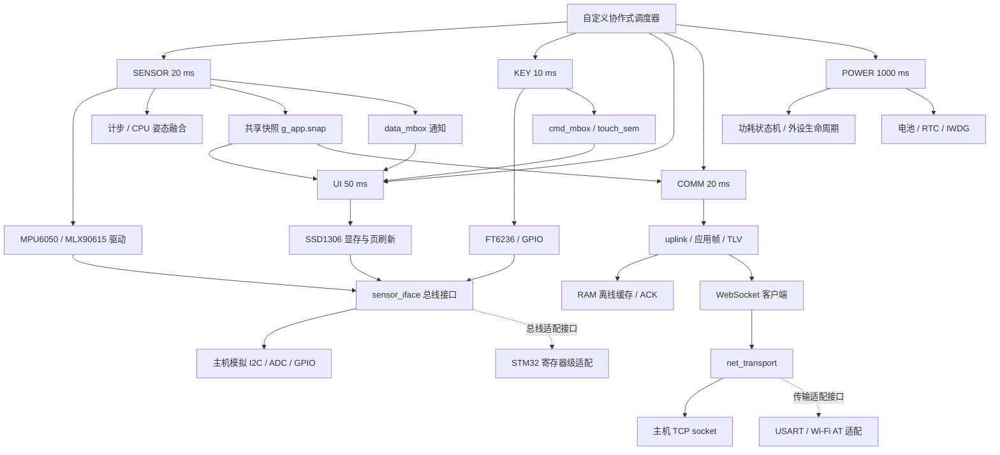

# STM32 可穿戴健康手环

[](https://github.com/xiaoli5201314-spec/stm32-wearable-health-band/actions/workflows/ci.yml)

**本仓库展示项目的公开代码与技术文档。** `stm32-wearable-health-band` 面向 STM32F405，采用 C99 组织运动采集、姿态计算、触摸交互、OLED 显示、数据通信和电源管理，将器件驱动、业务任务、通信协议与平台接口分层实现。

公开内容涵盖五任务协作式调度、多传感器驱动、CPU 姿态融合、WebSocket 数据链路、RAM 离线缓存与 ACK 补传，以及外设电源状态回调。配套的 Linux 主机仿真、模块测试和真实本地 TCP 联调，使代码结构、数据流与异常处理可以沿源码阅读和复现。

**技术关键词：** 嵌入式 C · STM32 寄存器级接口 · I2C / SMBus / ADC · 协作式调度 · SSD1306 · WebSocket · 状态机 · 自动化测试

## 项目概览

项目的阅读重点是嵌入式软件如何组织多外设协作：从采集数据、形成共享快照，到界面刷新与通信上行，再到外设生命周期和任务监督。以下模块分别对应驱动抽象、调度与同步、算法处理、协议设计和测试工程等能力。

| 公开模块 | 实现内容 | 源码入口 |
| --- | --- | --- |
| 应用与调度 | SENSOR、KEY、UI、COMM、POWER 五任务；自定义协作式调度、优先级、时间片记账、周期唤醒、信号量和 16 字节邮箱 | [app_main.c](firmware/src/app_main.c)、[task_sched.c](firmware/src/task_sched.c) |
| 运动与姿态 | MPU6050 六轴读取、CPU 四元数融合、滤波、计步与步频统计 | [mpu6050.c](firmware/drivers/mpu6050.c)、[step_counter.c](firmware/src/step_counter.c) |
| 温度与电量 | MLX90615 红外对象 / 环境温度、SMBus PEC；ADC / VREFINT 换算、OCV 估计与估算电流积分 | [mlx90615.c](firmware/drivers/mlx90615.c)、[battery.c](firmware/drivers/battery.c) |
| 触摸与显示 | FT6236 触摸手势、GPIO 输入、SSD1306 128×64 单色显存、点阵字库和页刷新 | [ft6236.c](firmware/drivers/ft6236.c)、[oled_ssd1306.c](firmware/drivers/oled_ssd1306.c)、[oled_font.c](firmware/drivers/oled_font.c) |
| 通信与补传 | 小端应用帧、CRC16、WebSocket 客户端、远程参数 TLV、RAM 缓存与按序号 ACK 确认 | [frame_codec.c](firmware/src/frame_codec.c)、[ws_client.c](firmware/src/ws_client.c)、[uplink.c](firmware/src/uplink.c)、[ring_buffer.c](firmware/src/ring_buffer.c) |
| 电源与任务监督 | RUN / IDLE / SLEEP / WAKEUP 软件状态、外设生命周期回调、事件日志、RTC 与 IWDG 任务心跳 | [power_mgr.c](firmware/src/power_mgr.c)、[rtc.c](firmware/drivers/rtc.c)、[iwdg.c](firmware/drivers/iwdg.c) |
| 平台与测试 | 模拟 I2C / ADC / GPIO、主机 socket、STM32 寄存器级接口与 Wi-Fi AT 适配；模块测试、应用冒烟和 CI | [sensor_iface.h](firmware/include/sensor_iface.h)、[platform/](firmware/platform/)、[run_tests.c](firmware/test/run_tests.c)、[ci.yml](.github/workflows/ci.yml) |

## 测试记录

**2026-10-02，Ubuntu 22.04 / GCC 11.4：** 主机测试、本地真实 TCP / WebSocket 联调和平台文件语法检查均有独立执行记录。

| 核验项目 | 已记录结果 |
| --- | --- |
| `make -C firmware -B test` | **PASS：180 个用例、1019 条断言、0 失败** |
| `make -C firmware live-test` | **PASS：2 次业务连接、10 个唯一应用序号；2 条在线发送、8 条离线缓存；8 / 8 条补传、最终缓存余量 0 条** |
| 联调数据检查 | 服务端重复序号、乱序和 CRC 错误均为 0；成功应用 1 次远程 TLV 更新 |
| ACK 统计 | 客户端收到 9 条 ACK，其中 1 条在线 ACK 的序号未命中缓存；服务端重复数据计数为 0 |
| `make -C firmware target-syntax` | **PASS：GCC `-fsyntax-only` 检查 4 个 STM32 平台 C 文件** |

执行环境、命令、ACK 统计解释与各验证层级见 [核验记录](docs/VERIFICATION.md)。测试数字对应记录中的代码状态与场景。

## 系统架构



SENSOR 更新共享快照 `g_app.snap` 并向 `data_mbox` 投递通知；UI 消费通知与输入事件，COMM 直接读取快照形成上传包。主机运行使用模拟总线和 TCP socket；图中的虚线列出按接口组织的 STM32 总线与 Wi-Fi AT 适配代码。

## 核心模块

### 调度与应用

[task_sched.c](firmware/src/task_sched.c)实现自定义协作式调度：任务以函数形式分步执行，通过 `return` 交回控制权；调度器根据就绪状态、优先级、轮转位置和时间片记账选择下一任务。`sched_tick()` 推进时间并唤醒到期任务，应用上下文由 [app_main.c](firmware/src/app_main.c)集中管理。

五个任务的登记周期分别为 SENSOR 20 ms、KEY 10 ms、UI 50 ms、COMM 20 ms、POWER 1000 ms。任务运行在调用方的共享栈上，执行权切换发生在任务函数返回之后；信号量与邮箱组织输入通知和任务间消息。`band_msg_t` 通过编译期长度断言遵循 16 字节消息契约。调度语义与同步写法见 [设计说明](docs/DESIGN.md)。

### 采集与算法

[mpu6050.c](firmware/drivers/mpu6050.c)负责加速度和角速度读取，应用采用原始六轴数据与 CPU 四元数融合计算姿态。[step_counter.c](firmware/src/step_counter.c)通过滤波、迟滞阈值、不应期和峰值间隔统计组织计步与步频处理。

[mlx90615.c](firmware/drivers/mlx90615.c)处理红外对象 / 环境温度、寄存器换算与 PEC 校验；[battery.c](firmware/drivers/battery.c)组织 ADC / VREFINT 换算、开路电压估计和电流积分，应用传入估算电流。总线操作通过 [sensor_iface.h](firmware/include/sensor_iface.h)抽象，主机测试注入寄存器和采样数据，检查换算与错误处理路径。

### 触摸与显示

[ft6236.c](firmware/drivers/ft6236.c)解析触摸点与手势，KEY 任务将触摸 / 按键事件写入 `cmd_mbox` 并通过 `touch_sem` 通知 UI。界面采用 [oled_ssd1306.c](firmware/drivers/oled_ssd1306.c)的 **128×64 单色显存、点阵字库和页刷新**，组织数据、温度、电池、网络及菜单页面。

主机演示执行界面绘制和模拟 I2C 写屏，以控制台日志呈现任务、器件状态与运行统计。显示驱动、字库和业务页面分别保留独立源码入口，便于阅读数据到界面的处理过程。

### 通信与缓存

[frame_codec.c](firmware/src/frame_codec.c)实现小端应用帧、序号、载荷长度和 CRC16；[ws_client.c](firmware/src/ws_client.c)组织 WebSocket 握手、客户端掩码、控制帧、分片处理及重连状态。[uplink.c](firmware/src/uplink.c)将应用数据封装为 binary 消息，并处理远程 TLV 参数与 ACK。

[ring_buffer.c](firmware/src/ring_buffer.c)管理 **64 个 RAM 缓存槽位，每条最多保存 128 字节整帧**。离线或直发失败时保存原始帧与序号，重连后每轮最多补传 8 条；ACK 依据载荷中的序号移除相应记录。缓存满时覆盖最旧记录，缓存生命周期随 RAM；在线直发与缓存补传采用各自的记录方式。

专用 [联调客户端](firmware/test/ws_live_client.c)与 [Python mock 服务端](tools/ws_mock_server.py)复现断线、缓存、重连、补传及参数更新。帧布局、ACK 语义、TLV 参数接入和交付边界见 [协议说明](docs/PROTOCOLS.md)。

### 电源与任务监督

[power_mgr.c](firmware/src/power_mgr.c)以 RUN / IDLE / SLEEP / WAKEUP 软件状态组织活动计时和外设生命周期，集中调用 `enter_low_power()`、`deinit()`、`exit_low_power()` 与 `init()`，并维护 128 条环形事件日志。

应用为器件注册电源回调，测试按事件日志检查休眠和恢复的调用顺序。[iwdg.c](firmware/drivers/iwdg.c)记录各任务心跳，由 POWER 任务执行超时监督与喂狗；RTC / IWDG 接口与业务状态机分层组织。软件状态、回调职责和目标平台集成细节见 [设计说明](docs/DESIGN.md)。

## 阅读路径

| 阅读目的 | 建议入口 |
| --- | --- |
| 快速了解项目与技术能力 | 本页项目概览、架构图与测试记录 |
| 理解任务和数据流 | [app_main.c](firmware/src/app_main.c) → [task_sched.c](firmware/src/task_sched.c) → [DESIGN.md](docs/DESIGN.md) |
| 查看驱动抽象与异常处理 | [sensor_iface.h](firmware/include/sensor_iface.h) → [drivers/](firmware/drivers/) → [test_drivers.c](firmware/test/test_drivers.c) |
| 深入通信与缓存 | [PROTOCOLS.md](docs/PROTOCOLS.md) → [uplink.c](firmware/src/uplink.c) → [ring_buffer.c](firmware/src/ring_buffer.c) |
| 复现测试与本地联调 | [BUILD_AND_TEST.md](docs/BUILD_AND_TEST.md) → [run_tests.c](firmware/test/run_tests.c) → [VERIFICATION.md](docs/VERIFICATION.md) |

## 目录导航

| 路径 | 阅读内容 |
| --- | --- |
| [firmware/src/](firmware/src/) | 应用、调度、帧协议、WebSocket、缓存、计步、电源管理 |
| [firmware/drivers/](firmware/drivers/) | 器件驱动、显示字库和数据换算 |
| [firmware/include/](firmware/include/) | 接口契约、数据结构、协议常量和编译期配置 |
| [firmware/platform/](firmware/platform/) | 主机模拟总线 / socket 与 STM32 寄存器 / AT 适配 |
| [firmware/test/](firmware/test/) | 模块测试、应用冒烟测试、真实 TCP 联调客户端 |
| [firmware/Makefile](firmware/Makefile) | 主机构建、测试和目标代码语法检查入口 |
| [tools/](tools/) | Python mock 服务端、联调脚本、字库生成脚本 |
| [docs/DESIGN.md](docs/DESIGN.md) | 调度语义、同步对象、电源生命周期及平台集成说明 |
| [docs/BUILD_AND_TEST.md](docs/BUILD_AND_TEST.md) | Linux / WSL 快速运行与分层测试方法 |
| [docs/PROTOCOLS.md](docs/PROTOCOLS.md) | 应用帧、ACK、TLV、WebSocket 的实际行为 |
| [docs/VERIFICATION.md](docs/VERIFICATION.md) | 核验日期、命令、工具链、结果与验证范围 |
| [.github/workflows/ci.yml](.github/workflows/ci.yml) | Ubuntu 主机构建与测试自动化 |

## 快速运行

在 Linux 或 WSL 中，安装 C 编译器、GNU Make、Python 3 后，从仓库根目录执行：

```bash
make -C firmware all
make -C firmware -B test
./firmware/build/band_demo 9
```

上述命令依次构建主机演示、强制重建并运行测试、执行约 9 秒的控制台演示。测试入口包含帧协议、计步、WebSocket、功耗、驱动、上行链路和应用冒烟测试；演示通过合成传感器数据运行任务、绘制与缓存逻辑，输出运行统计。

真实本地 TCP / WebSocket 联调使用独立客户端，平台文件检查使用主机 GCC：

```bash
make -C firmware live-test
make -C firmware target-syntax
```

`live-test` 启动 Python mock 服务端，通过 localhost TCP 测试 WebSocket 连接及缓存补传，默认地址为 `127.0.0.1:9001`、路径为 `/band`。端口需空闲，也可使用 `make -C firmware live-test WS_PORT=19001` 指定端口。`target-syntax` 通过 `-fsyntax-only` 检查 `port_stm32.c`、`bus_stm32.c`、`net_wifi_at.c` 和 `rtc_iwdg_port.c` 四个平台文件。

两项命令在 **2026-10-02** 的执行结果均为 PASS，详见 [核验记录](docs/VERIFICATION.md)。主机演示、模块测试、本地 TCP 联调与平台文件语法检查分别记录结果；构建产物、自定义目录、手动双终端运行和工具说明见 [BUILD_AND_TEST.md](docs/BUILD_AND_TEST.md)。

GitHub Actions 通过 [ci.yml](.github/workflows/ci.yml)在 Ubuntu 22.04 自动构建主机演示、执行模块测试和平台文件语法检查；首页徽章展示工作流状态。

## 数据与运行说明

健康字段用于原型展示与数据链路验证：界面中的“心率”字段来自运动峰值 / 步频估算，温度采用红外对象温度，均按**非医疗数据**理解。网络联调和远程参数下发请在**可信本地网络**中进行。

公开模块的设计细节、协议约束与验证范围分别记录在 [DESIGN.md](docs/DESIGN.md)、[PROTOCOLS.md](docs/PROTOCOLS.md)和 [VERIFICATION.md](docs/VERIFICATION.md)，可按阅读目的继续查阅。
