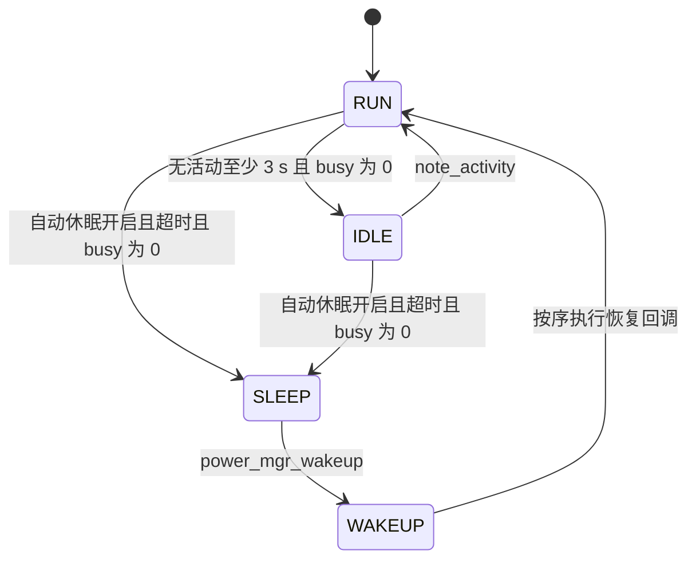

# 固件设计说明

本文依据当前源码描述调度、数据流、外设生命周期和目标集成状态，不提供栈峰值、最坏执行时间或真实硬件功耗测量结论。

阅读入口：[项目总览](../README.md)、[构建与测试](BUILD_AND_TEST.md)、[协议行为](PROTOCOLS.md)、[核验记录](VERIFICATION.md)。

## 1. 分层与平台边界

应用位于 [app_main.c](../firmware/src/app_main.c)，中间件位于 [src/](../firmware/src/)，器件驱动位于 [drivers/](../firmware/drivers/)。

平台接口分别隔离传感器总线、网络、时间与板级操作：

| 接口 | 主机侧 | STM32 侧 |
| --- | --- | --- |
| [sensor_iface.h](../firmware/include/sensor_iface.h) | [bus_sim.c](../firmware/platform/bus_sim.c)：模拟 I2C / ADC / GPIO | [bus_stm32.c](../firmware/platform/bus_stm32.c)：寄存器级总线实现 |
| [net_transport.h](../firmware/include/net_transport.h) | [net_socket.c](../firmware/platform/net_socket.c)：TCP socket | [net_wifi_at.c](../firmware/platform/net_wifi_at.c)：Wi-Fi AT 传输适配 |
| [band_port.h](../firmware/include/band_port.h) | [port_host.c](../firmware/platform/port_host.c) | [port_stm32.c](../firmware/platform/port_stm32.c) |
| RTC / IWDG 接口 | 模拟计时与喂狗行为 | [rtc_iwdg_port.c](../firmware/platform/rtc_iwdg_port.c)中的目标分支 |

接口分层便于复用与测试，但当前应用仍直接选择 `net_socket_get()`。存在目标适配文件不表示平台切换和完整目标运行已完成。

## 2. 自定义协作式调度器

### 2.1 执行模型

[task_sched.c](../firmware/src/task_sched.c)不是 uCOS-II / FreeRTOS，也不是抢占式内核。任务函数由 `sched_run_once()` 调用，执行一小步后通过 `return` 交回控制权。

- 优先级数值越大越优先；就绪任务间结合时间片和轮转位置选择。
- `sched_tick(elapsed_ms)`由调用方推进时间、唤醒到期任务并更新统计；调度器没有自行配置硬件 tick。
- 周期任务正常返回后转为 `TASK_BLOCKED`，唤醒时刻设为当前调度时间加 `period_ms`。
- 时间片只影响下一次调度选择，**不能强制中断正在执行的任务函数**。函数或 I/O 阻塞会延迟其他任务。
- 所有任务使用调用方的同一条栈；没有独立任务栈和上下文切换。共享栈仍有溢出风险，不能由此推导节省比例或栈容量足够。
- `cpu_ms` 是依据外部传入 tick 的记账值，不是逐函数计时、WCET 或目标 CPU 占用测量。

主机入口支持按真实时间运行；`band_app_run_steps()`每步推进 1 ms 虚拟时间，用于可重复的应用冒烟测试。虚拟 60 秒不代表在真实板上连续测量了 60 秒。

协作模型降低了执行上下文切换的复杂度，但不提供硬实时保证，也不能消除未来 ISR / DMA 并发访问共享状态的风险。

### 2.2 应用任务表

以下值直接来自 `band_app_init()`的登记调用，没有加入未测量的耗时和栈峰值。

| 任务 | 优先级 | 登记周期 | 时间片 | 当前职责 |
| --- | ---: | ---: | ---: | --- |
| `SENSOR` | 5 | 20 ms | 5 ms | 六轴读取、计步、CPU 姿态融合、约 1 Hz 红外读取、更新快照 |
| `KEY` | 4 | 10 ms | 3 ms | 触摸手势、GPIO 电平边沿检查、投递输入事件 |
| `UI` | 3 | 50 ms | 8 ms | 消费输入与数据通知、绘制页面、刷新 SSD1306、关闭超时马达标志 |
| `COMM` | 2 | 20 ms | 10 ms | 网络轮询、补传、按参数周期构造上传包 |
| `POWER` | 1 | 1000 ms | 5 ms | 电池采样与估算积分、功耗状态推进、任务监督喂狗 |

周期是调度配置，不是实际延迟上界。UI 每次被调度不一定刷屏：输入事件触发刷新，否则约 1 Hz 刷新一次。

### 2.3 信号量与邮箱

| 对象 | 配置 | 实际数据流 |
| --- | --- | --- |
| `touch_sem` | 初值 0、上限 4 | KEY 发布部分输入事件，UI 尝试获取以触发重绘 |
| `cmd_mbox` | 深度 8、消息 16 B | KEY 投递触摸 / 按键事件，UI 消费 |
| `data_mbox` | 深度 8、消息 16 B | SENSOR 投递通知及部分字段，UI 清空队列 |
| `g_app.snap` | 共享应用状态 | SENSOR / POWER 更新，UI / COMM 直接读取 |

因此不能把 `data_mbox` 描述为供 UI 和 COMM 各自消费的完整快照广播。当前 SENSOR 消息只带部分字段，完整数据留在共享快照。

`band_msg_t`使用编译期断言保证 `sizeof(band_msg_t) == MBOX_MSG_LEN`。这是可在源码核对的边界保护，不构成某次历史 ASan 运行或故障修复过程的证明。

### 2.4 阻塞操作的重试契约

`os_sem_pend()` / `os_mbox_pend()`不能把 C 函数挂起在任意语句上。拿不到资源时登记阻塞并返回失败，调用者必须立即返回；唤醒后任务从函数入口重新执行。跨调用的步骤状态需保存在任务上下文中。

```c
static void task_example(void *arg)
{
    band_msg_t msg;
    (void)arg;
    if (os_mbox_pend(&g_app.sched, &g_app.cmd_mbox, &msg, 100u) != 0) {
        return;
    }
    /* 在这里处理本次取得的消息。 */
}
```

这是应用内部写法示意，不是新增的任务或独立可编译样例。

## 3. 采集与显示的语义

- MPU6050 应用路径使用 `mpu6050_read_scaled()`及 `mpu6050_fuse_attitude()`，在 CPU 上做四元数 / 重力互补融合。
- 驱动还有 FIFO 和 28 字节 Q30 四元数包解析，但未见厂商 DMP 固件镜像或下载逻辑。`dmp_enabled`标志不能证明真实芯片已输出四元数。
- “心率”字段复用了运动峰值和步频检测，不存在 PPG 驱动及生理有效性验证；“本次未检测到一步”也不能证明处于静止状态。
- MLX90615 输出对象与环境温度。应用把对象温度写入名为 `body_temp_c`的字段，但它不自动成为经过校准的核心体温。
- 电量逻辑包括 ADC / VREFINT 换算、OCV 估计和电流积分。应用按运动状态传入约 `-2 mA`或 `-12 mA`，并非读取真实电流传感器。
- 显示为 SSD1306 128×64 单色显存与页刷新，不是 TFT 或 STemWin。主机侧只模拟写屏操作，无图形显示窗口。

相关实现：[MPU6050](../firmware/drivers/mpu6050.c)、[计步](../firmware/src/step_counter.c)、[红外温度](../firmware/drivers/mlx90615.c)、[电池](../firmware/drivers/battery.c)、[SSD1306](../firmware/drivers/oled_ssd1306.c)。

## 4. 功耗状态机与生命周期

### 4.1 软件状态



默认休眠阈值为自上次活动起 15 s，不是进入 IDLE 后再等 15 s。`WAKEUP`是一次唤醒调用内的过渡状态。

**软件状态与硬件动作须分开理解：**

| 状态 / 动作 | 当前代码实际行为 | 尚不能主张的效果 |
| --- | --- | --- |
| `IDLE` | 改变状态与日志 | 已降频、关闭背光或测得省电 |
| `SLEEP` | 按表调用外设低功耗 / 关闭回调 | 已进入 STM32 STOP 并暂停业务任务 |
| 唤醒 | 按反向顺序恢复回调、重置活动时间 | 中断唤醒、完整时钟恢复和传感器首帧可靠 |
| 主机应用模拟唤醒 | POWER 在 SLEEP 持续约 20 s 后调用唤醒函数 | 真实 RTC / EXTI 已唤醒设备 |

### 4.2 固定回调顺序

休眠顺序：

```text
MOTOR -> MLX90615 -> OLED -> BAT_ADC -> MPU6050 -> FT6236 -> WIFI
```

对已注册且 active 的非 `always_on`外设，先调用 `enter_low_power()`，再调用 `deinit()`。RTC / IWDG 标记为 `always_on`，跳过关闭。

唤醒顺序：

```text
WIFI -> FT6236 -> MPU6050 -> BAT_ADC -> OLED -> MLX90615 -> MOTOR
```

对记录为低功耗的外设，先调用 `exit_low_power()`，再调用 `init()`。这保证的是回调尝试顺序，不是所有器件都已经成功恢复：当前休眠 / 唤醒循环忽略部分回调错误，仍更新状态标志，没有完整失败回滚。

MLX90615、马达等应用回调包含仅修改软件标志的操作；不能解释成已经用 GPIO / MOS 断电。MPU6050 的进入低功耗与随后 sleep 操作、触摸电源模式也需在真实板上核对唤醒能力，不能仅按注释认定。

### 4.3 休眠条件与监督喂狗

`task_power()`统计其他处于 READY 的任务，不把自身算作忙；链路在线且仍有补传记录时也增加 busy。断网缓存本身不会阻止休眠。

活动计时依赖实际 `power_mgr_note_activity()`调用，不能假设所有触摸、运动、网络收发都已接入该计时。状态机不自动识别现实世界的空闲。

应用每个任务上报 IWDG 心跳，POWER 做监督式喂狗。完整 STOP 集成还必须处理休眠超过喂狗预算、IWDG 持续运行、时钟变化和任务暂停 / 恢复问题。

### 4.4 可测试性

`power_mgr_t`维护 128 条环形事件日志，记录状态和外设生命周期动作。[test_power_mgr.c](../firmware/test/test_power_mgr.c)可以检查回调顺序；应用冒烟测试可以检查 `sleep_count`。

这些证据不等于休眠电流、唤醒延迟或续航测量。仓库没有本次可核对的目标板电流波形、仪器记录、栈水位或 WCET 测量。

## 5. 补传设计与可靠性边界

[uplink.c](../firmware/src/uplink.c)在线直发成功时不保存记录；离线或直发失败时把编码后的整帧放入 RAM 缓存。缓存记录序号与帧头序号统一，避免 ACK 删除错误的记录。

缓存有 64 个槽，每槽最多 128 B **整帧**，所以可缓存应用载荷上限是 `128 - 9 = 119 B`，小于帧编解码层的 256 B 上限。缓存满会覆盖最旧记录并计数；掉电 / 重启没有恢复能力。

重连后 `resend_begin()`清除会话发送标志；每次轮询最多补传 8 条，按缓存插入顺序扫描，保留原始类型、序号、CRC。不是重新打包成 `MSG_OFFLINE_BATCH`，也不是等待旧记录全部确认后才允许新数据发送。

| 情况 | 当前行为 / 风险 |
| --- | --- |
| ACK 丢失 | 记录留在缓存，但同会话没有 ACK 超时重试；下一补传会话才重置发送标志 |
| 跨连接重发 | 可能重复发送同一记录；真实服务端需实现设备身份与持久幂等 |
| 非零 ACK status | 仍尝试删除对应记录，再累加否定确认统计；不能当作保留重试 |
| NACK 帧 | 只统计，不触发重试 |
| 乱序 ACK | 会话水位线可能跳过较旧未确认记录；不保证任意 ACK 顺序下完整补传 |
| 在线新数据与积压数据 | 可交错发送，不保证全局序号有序 |
| 在线发送成功但对端未落库 | 没有待 ACK 缓存记录，无法保证重传 |

[mock 服务端](../tools/ws_mock_server.py)统计重复、乱序和 CRC 错误，不是持久数据库或业务去重服务。2026-10-02 本地真实 TCP 联调通过，8 / 8 条缓存记录完成补传；完整结果见 [VERIFICATION.md](VERIFICATION.md)，不扩大为任意故障下的无损交付保证。详细 ACK / TLV / WebSocket 行为见 [PROTOCOLS.md](PROTOCOLS.md)。

## 6. STM32 集成待办

以下是当前源码可见的集成缺口，不是已经完成的启动流程：

1. 补齐启动文件、向量表、链接脚本和目标 `main()`；目前未见完整可烧录工程所需的这些产物。
2. 接入目标时钟、NVIC / 中断和调度 tick，核对 I2C、ADC、RTC、IWDG 的真实时序及故障行为。
3. 统一 USART1 引脚：[band_config.h](../firmware/include/band_config.h)声明 PA9 / PA10，但 [port_stm32.c](../firmware/platform/port_stm32.c)的 `board_usart1_init()`使用 PB6 / PB7，与 I2C1 配置冲突。
4. 将应用网络绑定到 AT 传输，显式调用 `uplink_connect()`；当前初始化仍选择 socket，未发起首次连接。
5. 补齐参数运行时接入：上传周期、马达开关会动态读取；其余大多只存储，休眠阈值只在初始化时设置。应用未注册参数回调，也未接入时间同步写 RTC。
6. 完成 STOP 入口、唤醒源配置、时钟恢复、业务任务暂停与 IWDG 策略；用真实板记录睡眠电流和唤醒行为。
7. 独立评估长期运动算法、温度标定、通信安全及服务端持久幂等。没有这些结果前，不声明医疗能力、精度、续航或生产可用性。

[PlatformIO 配置](../firmware/platformio.ini)是集成参考，不是已验证烧录入口；其中关于 startup 提供 `main()`的注释不构成文件存在的证据。`make target-syntax`也只做指定平台文件的主机语法检查，不能覆盖以上集成问题。
